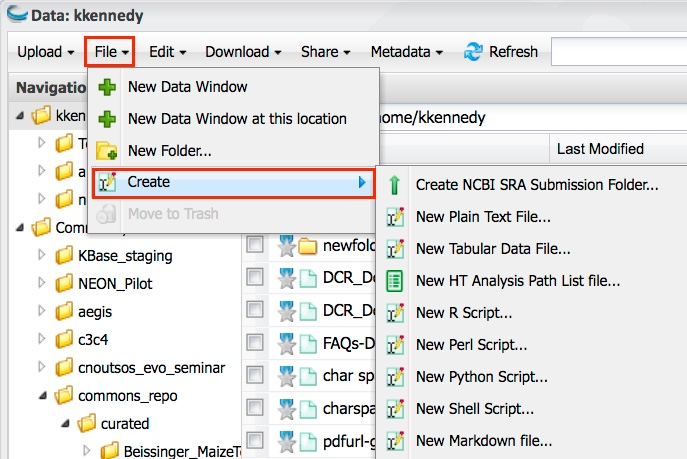

.. include:: cyverse_rst_defined_substitutions.txt
|CyVerse logo|_

|Home_Icon|_
`Learning Center Home <http://learning.cyverse.org/>`_

==============================
Creating New Files and Folders
==============================

You can create new **small** files and folders in your personal Data folder. File types include plain text, tabular data, R script, Perl, Python, Shell, and Markdown files. You also can create a list of files to use in HT (high-throughput) file execution.

After you create it, you can `edit <https://wiki.cyverse.org/wiki/display/DEmanual/Editing+the+Contents+of+a+File>`_ and `move <https://wiki.cyverse.org/wiki/display/DEmanual/Moving+a+Data+File+or+Folder>`_ the file or folder.

Before you begin, you may want to watch a `YouTube video on file creation, file editing, and tabular views <http://www.youtube.com/watch?v=mwaN3G2qEQs>`_.

+------------------------------------------------------------------------------------------------------------------------------------------------------------+
| See `Using Special Characters in the DE <https://wiki.cyverse.org/wiki/display/DEmanual/Using+Special+Characters+in+the+DE>`_ for notes about file names.  |
+------------------------------------------------------------------------------------------------------------------------------------------------------------+

Creating new folders
--------------------

    1. In the Data window, select the personal folder under which you want to add the new folder.
    2. Click **File** and then click **New Folder**.
    3. Enter a unique name for the new folder and click **OK**.

Creating new files
------------------

You can create new plain text and tabular data files, as well as files using R script, Perl, Python, Shell, and Markdown. You also can create a high-throughput file list.

NCBI SRA Submission Folder
--------------------------

You can create an NCBI SRA submission folder and then define its name and number of biosamples and libraries.

    1. In the Data window, select the personal folder under which you want to create the new submission folder. You can `move <https://wiki.cyverse.org/wiki/display/DEmanual/Moving+a+Data+File+or+Folder>`_ it later if necessary.
    2. Click **File**, click **Create**, and then click **Create NCBI SRA Submission Folder**.
    3. In the setup window, enter the project name, number of biosamples, and number of libraries.
    4. Click **OK**.

Plain text file
---------------

    1. In the Data window, select the personal folder under which you want to create the new text file. You can `move <https://wiki.cyverse.org/wiki/display/DEmanual/Moving+a+Data+File+or+Folder>`_ it later if necessary.
    2. Click **File**, point to **Create**, and then click **New Plain Text File**.
    3. In the file window, enter the text.
    4. When done, click Save, select a location in your personal folder space, enter a unique file name, and click OK.

Tabular data file
-----------------

############################

----

**Fix or improve this documentation:**

- On Github: |Github Repo Link|
- Send feedback: `Tutorials@CyVerse.org <Tutorials@CyVerse.org>`_
- Live chat/help: Click on the |intercom| on the bottom-right of the page for questions on documentation

----

|Home_Icon|_
`Learning Center Home <http://learning.cyverse.org/>`_

.. Comment: Place Images Below This Line
   use :width: to give a desired width for your image
   use :height: to give a desired height for your image
   replace the image name/location and URL if hyperlinked

 .. |Clickable hyperlinked image| image:: ./img/IMAGENAME.png
    :width: 500
    :height: 100
 .. _CyVerse logo: http://learning.cyverse.org/

 .. |Static image| image:: ./img/IMAGENAME.png
    :width: 25
    :height: 25

.. Comment: Place URLS Below This Line

   # Use this example to ensure that links open in new tabs, avoiding
   # forcing users to leave the document, and making it easy to update links
   # In a single place in this document

   .. |Substitution| raw:: html # Place this anywhere in the text you want a hyperlink

      <a href="REPLACE_THIS_WITH_URL" target="blank">Replace_with_text</a>

.. |Github Repo Link|  raw:: html

   <a href="FIX_FIX_FIX_FIX_FIX_FIX_FIX_FIX_FIX_FIX_FIX_FIX_FIX_FIX_FIX" target="blank">Github Repo Link</a>
