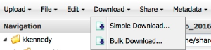

.. include:: cyverse_rst_defined_substitutions.txt
|CyVerse logo|_

|Home_Icon|_
`Learning Center Home <http://learning.cyverse.org/>`_

-----------------------------------
About downloading files and folders
-----------------------------------

You can download data items from another CyVerse user to your computer using either simple download, or using `Cyberduck <https://wiki.cyverse.org/wiki/display/DS/Using+Cyberduck+for+Uploading+and+Downloading+to+the+Data+Store>`_ to do a bulk download. 
You can also download data items outside the DE; some methods allow download without a CyVerse user account. For more information, see `Downloading and Uploading Data <https://wiki.cyverse.org/wiki/display/DS/Downloading+and+Uploading+Data>`_ and `Downloading Data Files Without a User Account <https://wiki.cyverse.org/wiki/display/DS/Downloading+Data+Files+Without+a+User+Account>`_.

- **Simple download** allows you to download single or multiple files (but not folders), and does not require any external app installation or configuration. 
- **Bulk download** allows you to download multiple files and folders, and requires installation and configuration of `Cyberduck <https://wiki.cyverse.org/wiki/display/DS/Using+Cyberduck+for+Uploading+and+Downloading+to+the+Data+Store>`_ (recommended).

In addition, you can use `iDrop Desktop <https://wiki.cyverse.org/wiki/display/DS/Using+iDrop+Desktop>`_ to upload and download data files outside of the DE, download a file via a `data link <https://wiki.cyverse.org/wiki/display/DEmanual/Sharing+Data+Files+Via+Public+Links>`_ that was shared by another CyVerse user, and `upload and import data files <https://wiki.cyverse.org/wiki/display/DEmanual/Uploading+and+Importing+Data+Items+Within+the+DE>`_.

Other Access Methods
--------------------

For a comparison of the different methods ofm uploading and downloading data items, see `Downloading and Uploading data <https://wiki.cyverse.org/wiki/display/DS/Downloading+and+Uploading+Data>`_.

Downloading files using simple download
---------------------------------------

.. |check| image:: img/check.png

    1. In the Data window, `search <https://wiki.cyverse.org/wiki/display/DEmanual/Searching+for+Data+Items>`_ for file or folder. You may want to `add the Path column <https://wiki.cyverse.org/wiki/display/DEmanual/Uploading%2C+Importing%2C+Downloading%2C+Sharing%2C+Editing%2C+Searching+Data+Files+in+the+DE#Uploading,Importing,Downloading,Sharing,Editing,SearchingDataFilesintheDE-pathcolumn>`_ to view the path. 

    |check| To perform an advanced query, such as including or excluding words in a file or folder name, searching for metadata attribute or value, file size range, created or modified date, owner, shared recipient, or tag, see `Searching for Data Items <https://wiki.cyverse.org/wiki/display/DEmanual/Searching+for+Data+Items>`_.

    2. Click **Download** and then click **Simple Download**.

        - If you selected one file:
            a. Verify **Save File** is selected and click **OK**.
            b. Browse to the folder location and click **Save**.
        - If you selected more than one file:
            a. Click the first file link, browse to the folder location, and click **Save**.
            b. Repeat for each file to download.
    3. When done, close the window. 

About bulk download
-------------------

The `Cyberduck <https://wiki.cyverse.org/wiki/display/DS/Using+Cyberduck+for+Uploading+and+Downloading+to+the+Data+Store>`_ application, which requires installation and configuration, is the recommended method for bulk transfer of files for Mac and Windows users. It replaces the iDrop Lite Java applet and iDrop, and is available for Mac OS and Windows. LINUX users should continue to use iCommands or iDrop Desktop instead. 

In addition to Cyberduck, you may still download files and folders within the DE using `simple download <https://pods.iplantcollaborative.org/wiki/display/DEmanual/Downloading+Files+and+Folders>`_, or upload or import files within the DE using `simple upload or import from URL <https://pods.iplantcollaborative.org/wiki/display/DEmanual/Uploading+and+Importing+Data+Items+Within+the+DE>`_. You may also use `iCommands <https://pods.iplantcollaborative.org/wiki/display/DS/Using+iCommands>`_.
**The method you use depends on the size and number of your data files, as well as your personal preferences. For a comparison of the different methods of uploading and downloading data items both within and outside the DE, see** `Downloading and Uploading Data <https://wiki.cyverse.org/wiki/display/DS/Downloading+and+Uploading+Data>`_.

About anonymous download (accessing data without a CyVerse account)
-------------------------------------------------------------------

Users who do not have a CyVerse account can download certain data files using an anonymous login. For more information, see `Downloading Data Files Without a User Account <https://wiki.cyverse.org/wiki/display/DS/Downloading+Data+Files+Without+a+User+Account>`_.

----

**Fix or improve this documentation:**

- On Github: |Github Repo Link|
- Send feedback: `Tutorials@CyVerse.org <Tutorials@CyVerse.org>`_
- Live chat/help: Click on the |intercom| on the bottom-right of the page for questions on documentation

----

|Home_Icon|_
`Learning Center Home <http://learning.cyverse.org/>`_

.. Comment: Place Images Below This Line
   use :width: to give a desired width for your image
   use :height: to give a desired height for your image
   replace the image name/location and URL if hyperlinked

 .. |Clickable hyperlinked image| image:: ./img/IMAGENAME.png
    :width: 500
    :height: 100
 .. _CyVerse logo: http://learning.cyverse.org/

 .. |Static image| image:: ./img/IMAGENAME.png
    :width: 25
    :height: 25

.. Comment: Place URLS Below This Line

   # Use this example to ensure that links open in new tabs, avoiding
   # forcing users to leave the document, and making it easy to update links
   # In a single place in this document

   .. |Substitution| raw:: html # Place this anywhere in the text you want a hyperlink

      <a href="REPLACE_THIS_WITH_URL" target="blank">Replace_with_text</a>

.. |Github Repo Link|  raw:: html

   <a href="FIX_FIX_FIX_FIX_FIX_FIX_FIX_FIX_FIX_FIX_FIX_FIX_FIX_FIX_FIX" target="blank">Github Repo Link</a>
