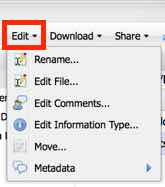
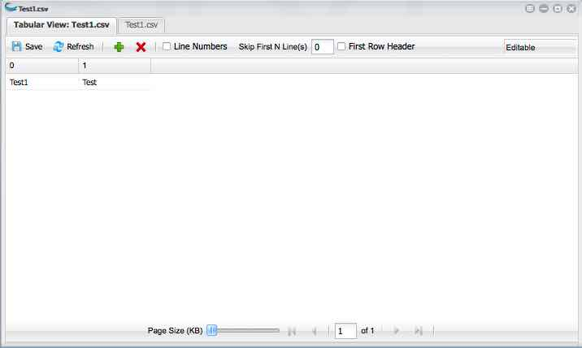

.. include:: cyverse_rst_defined_substitutions.txt
|CyVerse logo|_

|Home_Icon|_
`Learning Center Home <http://learning.cyverse.org/>`_

--------------------------------------------------
Using the Data Edit menu to edit files and folders
--------------------------------------------------

There are several different ways you can edit files and folders. You can `rename <https://wiki.cyverse.org/wiki/display/DEmanual/Renaming+a+Data+File+or+Folder>`_ a file or folder;
`edit <https://wiki.cyverse.org/wiki/display/DEmanual/Editing+the+Contents+of+a+File>`_ a file you own; add, edit, and retract `comments <https://wiki.cyverse.org/wiki/display/DEmanual/Viewing%2C+Adding%2C+and+Retracting+Data+Comments>`_; 
edit a file's `info-type <https://wiki.cyverse.org/wiki/display/DEmanual/Editing+a+File%27s+Info-Type>`_; move a file or folder; and add or edit `metadata <https://wiki.cyverse.org/wiki/display/DEmanual/Using+Metadata+in+the+DE>`_.

------------------------------
Editing the Contents of a File
------------------------------

You can edit a **one-page** plain text or tabular data (CSV, TSV) file that you own, both in the file view and in the Tabular View. **In order to do so, you adjust the Page Size (KB) slider until all of the data is displayed on one page.**

**If the file is too large, you can:**

   - **Create a copy of the file** by `downloading <https://wiki.cyverse.org/wiki/display/DEmanual/Downloading+Files+and+Folders>`_ the file, editing it as needed, and then `uploading <https://wiki.cyverse.org/wiki/display/DEmanual/Uploading+and+Importing+Data+Items+Within+the+DE>`_ it into the DE as a new file.

   - **Copy a large file** in the Data Store using the iCommands command line utility. For more information, see `Using iCommands <https://pods.iplantcollaborative.org/wiki/display/DS/Using+iCommands>`_.

   1. In the Data window, `search <https://wiki.cyverse.org/wiki/display/DEmanual/Searching+for+Data+Items>`_ for the file or folder. You may want to `add the Path column <https://wiki.cyverse.org/wiki/display/DEmanual/Uploading%2C+Importing%2C+Downloading%2C+Sharing%2C+Editing%2C+Searching+Data+Files+in+the+DE#Uploading,Importing,Downloading,Sharing,Editing,SearchingDataFilesintheDE-pathcolumn>`_ to view the path. 

      +--------------------------------------------------------------------------------------------------------------------------------------------------------------------------------------------------------------------------------------------------------------------------------------------------------------------------------+
      | To perform an advanced query, such as including or excluding wors in a file or folder name, searching for metadata attribute or value, file size range, created or modified date, owner, shared recipient, or tag, see `Searching for Data Items <https://wiki.cyverse.org/wiki/display/DEmanual/Searching+for+Data+Items>`_.  |
      +--------------------------------------------------------------------------------------------------------------------------------------------------------------------------------------------------------------------------------------------------------------------------------------------------------------------------------+

   2. Click the chekbox for the file you own.

   3. Click **Edit** and then click **Edit File**.

      When you first open the file, the **Page Size (KB) slider** by default is at the far left position, more than one page is displayed in the page navigation (unless the file is very small), the Save button is not enabled, and Not Editable is displayed.

      .. image:: img/EditTextFile1.png

   4. Drag the Page Size (KB) slider until the page navigation at the bottom displays 1 of 1.

      .. image:: img/EditTextFile2.png

      Once page 1 of 1 is displayed, the file becomes editable. If the file still is not editable, youn either don't have Own permissions to the file, the file is not an editable text file, or it is too large.

   
   5. Edit the file.
   6. When done, click **Save**.

Editing a File's Info-type
--------------------------

When a file is imported or uploaded, it is auto-assigned an info-type to identify the type of data it contains. You can change or assign the info-type for a file you own or to which you have write `permissions <https://wiki.cyverse.org/wiki/display/DEmanual/Sharing+Data+Files+and+Folders>`_. 
File-type auto-detection is available mfor text files, including .bam, .csv, .fasta, .fastq, .fa, .fq, .nwk, .newick, .phylip, .tsv, and more.

+-------------------------------------------------------------------------------------------------------------------------------------------------------------------------------------------------------------------------------------------+
| The automatic info-type assignment is an asynchronous process that is dependent on other requests in the queue, which may cause a delay until the info-type is assigned. You can manually assign the info-type immediately, if necessary. |
+-------------------------------------------------------------------------------------------------------------------------------------------------------------------------------------------------------------------------------------------+

   1. In the Data window, click the file you own. The Info-Type row in the details section on the right displays the current info-type, if any. 

   2. **To define or change the info-type:**

       a. Either click **Select** (if the info-type has not yet been defined) or click the current info-type in the Details section on the right, or click the **Edit** menu and then click **Edit Information Type**.

       b. In the **Select Type** drop-down list, select the info-type to use.

      +------------------------------------------------------------------------------------------------------------------------------------+
      | **File type not in the list?**                                                                                                     |
      +------------------------------------------------------------------------------------------------------------------------------------+
      | If your file type is not in the list, email `CyVerse Support <support@cyverse.org>`_ with the sample file to be added to the list. |
      +------------------------------------------------------------------------------------------------------------------------------------+

       c. Click **OK**.

   3. **To remove the info-type**, click |removeIcon| next to the Info-Type displayed in the Details section. 

----------------------------
Moving a Data File or Folder
----------------------------

You can move files or folders in your personal folder or that have been `shared with you with Own permissions <https://pods.iplantcollaborative.org/wiki/display/DEmanual/Sharing+Files+and+Folders>`_. Be aware that this will change the name for all other users who own or have share rights to that file or folder. You also can `open a new window <https://wiki.cyverse.org/wiki/display/DEmanual/Opening+New+Data+Windows>`_ and drag the item from one window to the other or use the Edit menu.

There is a limit of 1000 items (all files within all subfolders under the parent folder) per move. If the folder contains more than 1000 items, you can either create a new folder with the name to use, move up to 1000 files at a time until all files have been moved to the new folder, and then delete the older folder, or move them using `iCommands <https://wiki.cyverse.org/wiki/display/DS/Using+iCommands>`_.

+-------------------------------------------------------------------------------------------------------------------------------------------------------------------------------------------------------------------------------------------------------------------------------------------------------------------------------------------------------------------------------------------------------------------------------------------------------------------------+
| **If the item has been shared**                                                                                                                                                                                                                                                                                                                                                                                                                                         |
+-------------------------------------------------------------------------------------------------------------------------------------------------------------------------------------------------------------------------------------------------------------------------------------------------------------------------------------------------------------------------------------------------------------------------------------------------------------------------+
| When you move a file or folder, make sure the new location is also shared or it will no longer be accessible to the recipients and will need to be `reshared <https://wiki.cyverse.org/wiki/display/DEmanual/Sharing+and+Unsharing+Data+Files+and+Folders+in+the+DE>`_. For more information on permissions, see `Changing and Viewing Data Permission Levels <https://wiki.cyverse.org/wiki/display/DEmanual/Changing+and+Viewing+Data+Permission+Levels+in+the+DE>`_.  |
+-------------------------------------------------------------------------------------------------------------------------------------------------------------------------------------------------------------------------------------------------------------------------------------------------------------------------------------------------------------------------------------------------------------------------------------------------------------------------+

   1. In the Data window, `search <https://wiki.cyverse.org/wiki/display/DEmanual/Searching+for+Data+Items>`_ for the file or folder. You may want to `add the Path column <https://wiki.cyverse.org/wiki/display/DEmanual/Uploading%2C+Importing%2C+Downloading%2C+Sharing%2C+Editing%2C+Searching+Data+Files+in+the+DE#Uploading,Importing,Downloading,Sharing,Editing,SearchingDataFilesintheDE-pathcolumn>`_ to view the path. 

   +--------------------------------------------------------------------------------------------------------------------------------------------------------------------------------------------------------------------------------------------------------------------------------------------------------------------------------+
   | To perform an advanced query, such as including or excluding words in a file or folder name, searching for metadata attribute or value, file size range, created or modified date, owner, shared recipient, or tag, see `Searching for Data items <https://wiki.cyverse.org/wiki/display/DEmanual/Searching+for+Data+Items>`_. |
   +--------------------------------------------------------------------------------------------------------------------------------------------------------------------------------------------------------------------------------------------------------------------------------------------------------------------------------+

       - **To drag a file or folder to a different window:**

          a. Click to select the file or folder.
          b. `Open a new Data window. <https://wiki.cyverse.org/wiki/display/DEmanual/Opening+New+Data+Windows>`_. 
          c. Drag the item in one window to the new location in the other window. 

      - **To use the Edit menu:**

          a. Click the item to move.
          b. Click **Edit**, click **Move**, naviagte to the target folder location, and click **OK**.

------------------------------
Renaming a Data File or Folder
------------------------------

You can rename a file or folder that is in your personal folder or one that has been `shared with you <https://pods.iplantcollaborative.org/wiki/display/DEmanual/Sharing+Files+and+Folders>`_. Be aware that renaming a shared item also renames it for all other users who own or have share rights to that file or folder.

You can rename a folder that contains up to 1000 items (all files within all subfolders under the parent folder). If the folder contains more than 1000 items, you must either rename the folder using `iCommands <https://wiki.cyverse.org/wiki/display/DS/Using+iCommands>`_, or you can create a new folder in the DE with the name to use, move up to 1000 files at a time until all files have been moved to the new folder, and then delete the older folder.

   1. In the Data window, `search <https://wiki.cyverse.org/wiki/display/DEmanual/Searching+for+Data+Items>`_ for the file or folder. You may want to `add the Path column <https://wiki.cyverse.org/wiki/display/DEmanual/Uploading%2C+Importing%2C+Downloading%2C+Sharing%2C+Editing%2C+Searching+Data+Files+in+the+DE#Uploading,Importing,Downloading,Sharing,Editing,SearchingDataFilesintheDE-pathcolumn>`_ to view the path. 

   +--------------------------------------------------------------------------------------------------------------------------------------------------------------------------------------------------------------------------------------------------------------------------------------------------------------------------------+
   | To perform an advanced query, such as including or excluding words in a file or folder name, searching for metadata attribute or value, file size range, created or modified date, owner, shared recipient, or tag, see `Searching for Data Items. <https://wiki.cyverse.org/wiki/display/DEmanual/Searching+for+Data+Items>`_ |
   +--------------------------------------------------------------------------------------------------------------------------------------------------------------------------------------------------------------------------------------------------------------------------------------------------------------------------------+

   2. In the middle section, select the data files or items (up to 1000) to rename.
   3. Click **Edit** and then click **Rename**.
   4. Enter a unique name (see Using `Special Characters in the DE <https://wiki.cyverse.org/wiki/display/DEmanual/Using+Special+Characters+in+the+DE>`_ for notes about file and folder names), and click OK.

 

----------------------------------
Viewing and Customizing Data Files
----------------------------------

You can view data files, raw data, and CSV and TSV files in tabular or comma-delimited view. You also can sort, filter, and show or hide columns in some CSV and TSV files, and `edit text files <https://wiki.cyverse.org/wiki/display/DEmanual/Editing+the+Contents+of+a+File>`_ you own. The information that is viewable or editable is dependent on the type of file chosen. Before you  begin, you may want to watch a YouTube video on `file creation, editing, and tabular views <http://www.youtube.com/watch?v=mwaN3G2qEQs>`_.

   1. In the Data window, `find the file <https://wiki.cyverse.org/wiki/display/DEmanual/Searching+for+Data+Items>`_.

   +------------------------------------------------------------------------------------------------------------------------------------------------------------------------------------------------------------------------+
   | If you get a message that there are no items to display, it is possible the folder or file has a `special character in its name <https://wiki.cyverse.org/wiki/display/DEmanual/Using+Special+Characters+in+the+DE>`_. | 
   +------------------------------------------------------------------------------------------------------------------------------------------------------------------------------------------------------------------------+

   2. Click to open the file.

    .. image:: img/ViewFile1-8-8.png

       - **Save** is available only for editable files for which you are the `owner <https://wiki.cyverse.org/wiki/display/DEmanual/Changing+and+Viewing+Data+Permission+Levels+in+the+DE>`_.
       - **Refresh** allows you to update the window.
       - **Wrap Text** displays the tet wrapped within the window. 
       - **Not Editable** is displayed for files that are displayed on more than one page. 
       - **Editable** is displayed only when the entire contents of the file fit on only one page (adjusted using the Page Size (KB) slider). To save changes to the file, you must be an owner of it.
       - The page slider allows you to view more or less of the file.
       - Page navigation allows you to easily navigate between pages of the file.

Viewing and Customizing CSV and TSV files
-----------------------------------------

In addition to the default (delimited) tab view for CSV and TSV files, files that have been defined with an `info-type <https://wiki.cyverse.org/wiki/display/DEmanual/Editing+a+File%27s+Info-Type>`_ of CSV or TSV also display a Tabular View tab, within which you can add or remove rows, skip first lines, define the first row header, as well as sort, filter, and show or hide columns.

In the Data window, click to open the CSV or TSV file to view:

   - **Save** is available only for editable files for which you are the `owner <https://wiki.cyverse.org/wiki/display/DEmanual/Changing+and+Viewing+Data+Permission+Levels+in+the+DE>`_.
   - **Refresh** allows you to update the tab.
   - ..image:: img/TabViewCsvAddDeleteRowIcons.png (Add Row and Delete Row), available only when the file is Editable, allows you to add or remove rows from the table.
   - **Skip First N Lines(s)** hides the specified number of lines.
   - **First Row Header** displays the first row of the table as the table header.
   - **Not Editable** is displayed for files that are displayed on more than one page.
   - **Editable** is displayed only when the entire contents of the file fit on only one page (adjusted using the Page Size (KB) slider). To save changes to the file, you must be an owner of it.
   - The page slider allows you to view more or less of the file.
   - Page navigation allows you to easily navigate between pages of the file.

Sorting, filtering, and customizing columns in CSV and TSV files
----------------------------------------------------------------

In CSV and TSV files with the Tabular View tab (the file must be defined with an `info-type <https://wiki.cyverse.org/wiki/display/DEmanual/Editing+a+File%27s+Info-Type>`_ of either CSV or TSV), you can sort and filter columns, and hide or show columns to customize the look of your list.

   1. In the open CSV or TSV file, hover over the file's column header until a down arrow is displayed:

   .. image:: img/DataColumns.gif

   2. Click the down arrrow:

      - **Sort Ascending** or **Sort Descending**: To **sort** on the column, click either **Sort Ascending** or **Sort Descending**.
      - **Columns**: To hide or show a column, point to **Columns** and then select or clear the checkbox for the column to show or hide.

   3. To **filter** on data in the column:

       a. Point to **Filters**.
       b. In the text box, enter the filter text (not case-sensitive). The list is filtered for the query you entered.

---------------------------------------------
Viewing, adding, and retracting data comments
---------------------------------------------

You can view comments by other users about a file or folder, add comments to any file, and retract any comments you made. You also can retract comments made by other users if you are an owner of the item. Retraction removes the content of the comment but leaves the author's name and date the comment was added.

   1. In the Data window, `search <https://wiki.cyverse.org/wiki/display/DEmanual/Searching+for+Data+Items>`_ for the file or folder. You may want to `add the Path column <https://wiki.cyverse.org/wiki/display/DEmanual/Uploading%2C+Importing%2C+Downloading%2C+Sharing%2C+Editing%2C+Searching+Data+Files+in+the+DE#Uploading,Importing,Downloading,Sharing,Editing,SearchingDataFilesintheDE-pathcolumn>`_ to view the path.

   +--------------------------------------------------------------------------------------------------------------------------------------------------------------------------------------------------------------------------------------------------------------------------------------------------------------------------------+
   | To perform an advanced query, such as including or excluding words in a file or folder name, searching for metadata attribute or value, file size range, created or modified date, owner, shared recipient, or tag, see `Searching for Data Items <https://wiki.cyverse.org/wiki/display/DEmanual/Searching+for+Data+Items>`_. |
   +--------------------------------------------------------------------------------------------------------------------------------------------------------------------------------------------------------------------------------------------------------------------------------------------------------------------------------+

   2. Click |appcomments| on the right side of the row, or click the **Edit** menu and then click **Edit Comments**.

   3. Either:
         - **To add a comment**, click in the lower text box and enter your comment, and then click **Add**. Your comment is added to the top section and now visible to other users.
         - **To retract a comment**, click **Retract** in the Comments window, and then click **Yes** in the confirmation prompt. Your comment text is removed and is replaced with *This comment is retracted*.

----------------------------------
Deleting Files and Folders (Trash)
----------------------------------

You can delete a file or folder in your personal folder, or a file or folder that has been `shared with you with Own permissions <https://pods.iplantcollaborative.org/wiki/display/DEmanual/Sharing+Files+and+Folders>`_, which moves it to your Trash folder. Deleting a shared item also deletes it for all other users who own or have share rights to that file or folder. After you have deleted a file or folder, you can view the list of items in the Trash, restore a deleted file or folder, and permanently delete some or all items.

There is a limit of 1000 items (all files within all subfolders under the parent folder) per delete, restore, or permanent deletion. If the folder contains more than 1000 items, you can either delete up to 1000 files at a time until all files have been moved to your Trash, or move them using `iCommands <https://wiki.cyverse.org/wiki/display/DS/Using+iCommands>`_.

   1. In the Data window, select the file or folder to delete in your middle section.

   2. Click **File** and then click **Move to Trash**.

----

**Fix or improve this documentation:**

- On Github: |Github Repo Link|
- Send feedback: `Tutorials@CyVerse.org <Tutorials@CyVerse.org>`_
- Live chat/help: Click on the |intercom| on the bottom-right of the page for questions on documentation

----

|Home_Icon|_
`Learning Center Home <http://learning.cyverse.org/>`_

.. Comment: Place Images Below This Line
   use :width: to give a desired width for your image
   use :height: to give a desired height for your image
   replace the image name/location and URL if hyperlinked

 .. |Clickable hyperlinked image| image:: ./img/IMAGENAME.png
    :width: 500
    :height: 100
 .. _CyVerse logo: http://learning.cyverse.org/

 .. |Static image| image:: ./img/IMAGENAME.png
    :width: 25
    :height: 25

.. Comment: Place URLS Below This Line

   # Use this example to ensure that links open in new tabs, avoiding
   # forcing users to leave the document, and making it easy to update links
   # In a single place in this document

   .. |Substitution| raw:: html # Place this anywhere in the text you want a hyperlink

      <a href="REPLACE_THIS_WITH_URL" target="blank">Replace_with_text</a>

.. |Github Repo Link|  raw:: html

   <a href="FIX_FIX_FIX_FIX_FIX_FIX_FIX_FIX_FIX_FIX_FIX_FIX_FIX_FIX_FIX" target="blank">Github Repo Link</a>
