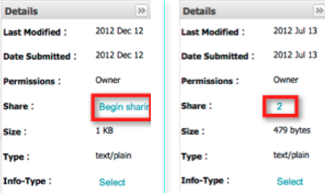
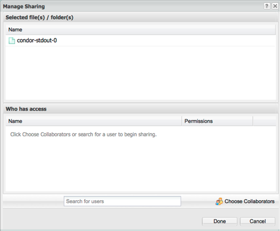

.. include:: cyverse_rst_defined_substitutions.txt
|CyVerse logo|_

|Home_Icon|_
`Learning Center Home <http://learning.cyverse.org/>`_

------------------------------
Sharing Data Files and Folders
------------------------------

You can `share files and folders <https://wiki.cyverse.org/wiki/display/DEmanual/Sharing+and+Unsharing+Data+Files+and+Folders+in+the+DE>`_ you own in your personal folder with any CyVerse user via the Discovery Environment.
By default, recipients with accounts receive read-only permissions to the specifically shared data item, folder, or subfolder. The owner who shared the item can `change the permission <https://wiki.cyverse.org/wiki/display/DEmanual/Changing+and+Viewing+Data+Permission+Levels+in+the+DE>`_ level to **write**, **own**, or back to **read** for each recipient on a per-item basis. Changing to own grants full rights (ability to rename, move, and delete) to the item so should be done with care. You also can `unshare the file or folder <https://wiki.cyverse.org/wiki/display/DEmanual/Unsharing+Files+and+Folders>`_ on a per-item basis.
Files and folders that have been shared via the DE `can be accessed <https://wiki.cyverse.org/wiki/display/DEmanual/Accessing+Shared+Files+and+Folders>`_ in the user's **Shared With Me** folder in his or her Data list in the DE. Clicking the notification of the shared file also opens the folder.
For instructions on how recipients can access shared items, see `Accessing Shared Files and Folders <https://wiki.cyverse.org/wiki/display/DEmanual/Accessing+Shared+Files+and+Folders>`_. CyVerse users can also `create a list of those Collaborators <https://wiki.cyverse.org/wiki/display/DEmanual/Adding+and+Deleting+Users+from+the+Collaborators+List+in+Preferences>`_ you most frequently share with, and request a `permanent identifier <https://wiki.cyverse.org/wiki/display/DC/Requesting+a+Permanent+Identifier+in+the+Data+Commons>`_ (a DOI or ARK) for easy sharing.
Data files of up to 2 GB can be shared with the public and anonymous users (no account required) by `sending a Public Link for files you own <https://wiki.cyverse.org/wiki/display/DEmanual/Sharing+Data+Files+Via+Public+Links>`_, which allows anyone with the link to download the file in order to view, analyze, and manipulate it on his or her system, independent of the CyVerse Data Store or the need for an account.
Before you begin, you may want to watch a `video <http://www.youtube.com/watch?v=iZDj_MMX3hg>`_ about data sharing in the Discovery Environment (current for version 1.6).

------------------------------------------------------
Sharing and Unsharing Data Files and Folders in the DE
------------------------------------------------------

Before you begin, you may want to read an overview about sharing data files and folders in the DE above. 
You can share an item you own with someone in your Collaborators list or any other DE user. 
Access is granted only to the specifically shared data item, folder, or subfolder. You also can request a permanent identifier (a DOI or ARK) within the DE. 
For information on how to do so, see `Requesting a Permanent Identifier in the Data Commons <https://wiki.cyverse.org/wiki/display/DC/Requesting+a+Permanent+Identifier+in+the+Data+Commons>`_.

------------------------
Sharing a file or folder
------------------------

Step 1: Share the file or folder
--------------------------------

    1. In the Data window, `search <https://wiki.cyverse.org/wiki/display/DEmanual/Searching+for+Data+Items>`_ for the file or folder. You may want to `add the Path column <https://wiki.cyverse.org/wiki/display/DEmanual/Uploading%2C+Importing%2C+Downloading%2C+Sharing%2C+Editing%2C+Searching+Data+Files+in+the+DE#Uploading,Importing,Downloading,Sharing,Editing,SearchingDataFilesintheDE-pathcolumn>`_ to view the path.

    +-----------------------------------------------------------------------------------------------------------------------------------------------------------------------+
    | To perform an advanced query, such as including or excluding words in a file or folder name, searching for metadata attribute or value, file size range,              |
    | created or modified date, owner, shared recipient, or tag, see `Searching for Data Items. <https://wiki.cyverse.org/wiki/display/DEmanual/Searching+for+Data+Items>`_ |
    +-----------------------------------------------------------------------------------------------------------------------------------------------------------------------+

    2. Either:

        - Click **Share** on the toolbar and then click **Share With Collaborators**.

        *or*

        - In the **Details** section, click either **Begin sharing** (if the item has not been shared) or click the numeral in the **Share** line (displaying the number of users with whom the item has been shared).

+------------------------------------------------------------+
| **Share not available?**                                   |
+------------------------------------------------------------+
| You must be an owner to share the file or folder.          |
+------------------------------------------------------------+

The Manage Sharing window opens, displaying the name of the file or folder and the names of any CyVerse users with whom you have already shared the file or folder.

Step 2: Select the recipients
-----------------------------

    1. Either:

        - Select a user in your `Collaborators list <https://wiki.cyverse.org/wiki/display/DEmanual/Adding+and+Deleting+Users+from+the+Collaborators+List+in+Preferences>`_: Click **Choose Collaborators**, select the user, click **OK**, and then click **Done**.

        *or*

        - Search for any CyVerse use by clicking in the search field, begin entering the user's name, and then click the user's name from the list.

Step 3: Changing the permission level
-------------------------------------

    1. Either:

        - To allow the user only to read the item, leave the Permissions level at **read**.

        - To allow the user to add metadata and change the info-type, click **write**.

        - To grant the user full access to the item, including the ability to rename, move, and delete, click **own**.

        +---------------------------------------------------------------------------------------------------------------------------------------------------------------------------------------------------+
        | **Use Caution**                                                                                                                                                                                   |
        +---------------------------------------------------------------------------------------------------------------------------------------------------------------------------------------------------+
        | Learn more about `permission levels <https://wiki.cyverse.org/wiki/display/DEmanual/Changing+and+Viewing+Data+Permission+Levels+in+the+DE>`_ before you grant this ownership level.               |
        +---------------------------------------------------------------------------------------------------------------------------------------------------------------------------------------------------+

    
    2. Repeat for each user.

    3. Click **Done**.
        Both the sharer and the recipient recieve notification that the data item has been shared.

Unsharing a file or folder in the Data window
---------------------------------------------

    .. |xIcon| image:: img/X-icon.png

    .. |collab| image:: img/CurrentCollabIcon.jpg

    1. Find and select the shared data item you own to which you want to revoke sharing.
    
    2. Either click |collab| next to the item, or click the checkbox for the item and then click the **Share** menu and then click **Share with Collaborators**.
    
    3. Click |xIcon|.
    
    4. Click **Done**.

-----------------------------------
Sharing Data Files Via Public Links
-----------------------------------

You can create and send a public link to a data **file** (though not for a folder) you own. Once the recipient has the link to the file, it can be downloaded for purposes of validating, manipulating, or analyzing the file or results on their system.

The advantages are that the recipient does not have to have a CyVerse account in order to download the file through the link, and the original file is not affected because the downloaded file is used on his or her system instead of in the CyVerse Data Store.

You can send the same public link to more than one recipient, or create separate public links for each recipient. Separate public links are useful when you want to share or revoke access to the same file on a per-recipient basis, while sending the same link to a group of recipients allows you to share or revoke access to the file in one action.

To create the public link, the owner selects the file, creates the link, and then emails, tweets, or text the link to the recipient.
    
    - If you previously `shared <https://wiki.cyverse.org/wiki/display/DEmanual/Sharing+Files+and+Folders>`_ the file in the DE, clicking the link takes the recipient CyVerse user to the Shared With Me folder under the name of the owner who shared the file. From there, the recipient can download or view the shared file within that Shared With Me folder.

    - If you have not shared the file, clicking the link opens a download window from which the recipient can download the file.

+-----------------------------------------------------------------------------------------------------------------------------------------------------------------------------------------------------------------------------------------------------------------+
| **Recipient has the file? Deactivate it.**                                                                                                                                                                                                                      |
+-----------------------------------------------------------------------------------------------------------------------------------------------------------------------------------------------------------------------------------------------------------------+
| Once the recipient has downloaded the file using the public link, it is recommended that you `deactivate <https://wiki.cyverse.org/wiki/display/DEmanual/Sharing+Data+Files+Via+Public+Links#SharingDataFilesViaPublicLinks-DeactivatePublicLink>`_ the link.   |
+-----------------------------------------------------------------------------------------------------------------------------------------------------------------------------------------------------------------------------------------------------------------+

You can create a public link to a file you own in several different ways: by creating the URL to the file from which the user can import the file via URL to the DE, or by creating an iRODS iget iCommand, the Gnu Wget command, or cURL statement. Once the link is created, you copy the link and send the message.

You also can send a `shared path folder link <https://wiki.cyverse.org/wiki/display/DEmanual/Creating+Shared+Path+Folder+Links>`_ to a DE user so that any files that have been shared with that recipient are available and `share data files you own with the public <https://wiki.cyverse.org/wiki/display/DS/Sharing+Data+with+the+Public+in+the+Community+Data+Directory+and+Mirrors+Site>`_ in the Mirrors site.

+-------------------------------------------------------------------------------------------------------------------------------------------------------------------------------+
| For more information about other methods of accessing data, see `Downloading and Uploading Data <https://wiki.cyverse.org/wiki/display/DS/Downloading+and+Uploading+Data>`_.  |
+-------------------------------------------------------------------------------------------------------------------------------------------------------------------------------+

----

**Fix or improve this documentation:**

- On Github: |Github Repo Link|
- Send feedback: `Tutorials@CyVerse.org <Tutorials@CyVerse.org>`_
- Live chat/help: Click on the |intercom| on the bottom-right of the page for questions on documentation

----

|Home_Icon|_
`Learning Center Home <http://learning.cyverse.org/>`_

.. Comment: Place Images Below This Line
   use :width: to give a desired width for your image
   use :height: to give a desired height for your image
   replace the image name/location and URL if hyperlinked

 .. |Clickable hyperlinked image| image:: ./img/IMAGENAME.png
    :width: 500
    :height: 100
 .. _CyVerse logo: http://learning.cyverse.org/

 .. |Static image| image:: ./img/IMAGENAME.png
    :width: 25
    :height: 25

.. Comment: Place URLS Below This Line

   # Use this example to ensure that links open in new tabs, avoiding
   # forcing users to leave the document, and making it easy to update links
   # In a single place in this document

   .. |Substitution| raw:: html # Place this anywhere in the text you want a hyperlink

      <a href="REPLACE_THIS_WITH_URL" target="blank">Replace_with_text</a>

.. |Github Repo Link|  raw:: html

   <a href="FIX_FIX_FIX_FIX_FIX_FIX_FIX_FIX_FIX_FIX_FIX_FIX_FIX_FIX_FIX" target="blank">Github Repo Link</a>
