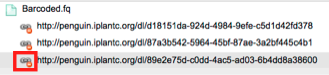
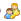

.. include:: cyverse_rst_defined_substitutions.txt
|CyVerse logo|_

|Home_Icon|_
`Learning Center Home <http://learning.cyverse.org/>`_

------------------------------
Sharing Data Files and Folders
------------------------------

You can `share files and folders <https://wiki.cyverse.org/wiki/display/DEmanual/Sharing+and+Unsharing+Data+Files+and+Folders+in+the+DE>`_ you own in your personal folder with any CyVerse user via the Discovery Environment.
By default, recipients with accounts receive read-only permissions to the specifically shared data item, folder, or subfolder. The owner who shared the item can `change the permission <https://wiki.cyverse.org/wiki/display/DEmanual/Changing+and+Viewing+Data+Permission+Levels+in+the+DE>`_ level to **write**, **own**, or back to **read** for each recipient on a per-item basis. Changing to own grants full rights (ability to rename, move, and delete) to the item so should be done with care. You also can `unshare the file or folder <https://wiki.cyverse.org/wiki/display/DEmanual/Unsharing+Files+and+Folders>`_ on a per-item basis.
Files and folders that have been shared via the DE `can be accessed <https://wiki.cyverse.org/wiki/display/DEmanual/Accessing+Shared+Files+and+Folders>`_ in the user's **Shared With Me** folder in his or her Data list in the DE. Clicking the notification of the shared file also opens the folder.
For instructions on how recipients can access shared items, see `Accessing Shared Files and Folders <https://wiki.cyverse.org/wiki/display/DEmanual/Accessing+Shared+Files+and+Folders>`_. CyVerse users can also `create a list of those Collaborators <https://wiki.cyverse.org/wiki/display/DEmanual/Adding+and+Deleting+Users+from+the+Collaborators+List+in+Preferences>`_ you most frequently share with, and request a `permanent identifier <https://wiki.cyverse.org/wiki/display/DC/Requesting+a+Permanent+Identifier+in+the+Data+Commons>`_ (a DOI or ARK) for easy sharing.
Data files of up to 2 GB can be shared with the public and anonymous users (no account required) by `sending a Public Link for files you own <https://wiki.cyverse.org/wiki/display/DEmanual/Sharing+Data+Files+Via+Public+Links>`_, which allows anyone with the link to download the file in order to view, analyze, and manipulate it on his or her system, independent of the CyVerse Data Store or the need for an account.
Before you begin, you may want to watch a `video <http://www.youtube.com/watch?v=iZDj_MMX3hg>`_ about data sharing in the Discovery Environment (current for version 1.6).

------------------------------------------------------
Sharing and Unsharing Data Files and Folders in the DE
------------------------------------------------------

Before you begin, you may want to read an overview about sharing data files and folders in the DE above. 
You can share an item you own with someone in your Collaborators list or any other DE user. 
Access is granted only to the specifically shared data item, folder, or subfolder. You also can request a permanent identifier (a DOI or ARK) within the DE. 
For information on how to do so, see `Requesting a Permanent Identifier in the Data Commons <https://wiki.cyverse.org/wiki/display/DC/Requesting+a+Permanent+Identifier+in+the+Data+Commons>`_.

------------------------
Sharing a file or folder
------------------------

Step 1: Share the file or folder
--------------------------------

    1. In the Data window, `search <https://wiki.cyverse.org/wiki/display/DEmanual/Searching+for+Data+Items>`_ for the file or folder. You may want to `add the Path column <https://wiki.cyverse.org/wiki/display/DEmanual/Uploading%2C+Importing%2C+Downloading%2C+Sharing%2C+Editing%2C+Searching+Data+Files+in+the+DE#Uploading,Importing,Downloading,Sharing,Editing,SearchingDataFilesintheDE-pathcolumn>`_ to view the path.

    +-----------------------------------------------------------------------------------------------------------------------------------------------------------------------+
    | To perform an advanced query, such as including or excluding words in a file or folder name, searching for metadata attribute or value, file size range,              |
    | created or modified date, owner, shared recipient, or tag, see `Searching for Data Items. <https://wiki.cyverse.org/wiki/display/DEmanual/Searching+for+Data+Items>`_ |
    +-----------------------------------------------------------------------------------------------------------------------------------------------------------------------+

    2. Either:

        - Click **Share** on the toolbar and then click **Share With Collaborators**.

        *or*

        - In the **Details** section, click either **Begin sharing** (if the item has not been shared) or click the numeral in the **Share** line (displaying the number of users with whom the item has been shared).

.. image:: img/searching-dataItems.png

+------------------------------------------------------------+
| **Share not available?**                                   |
+------------------------------------------------------------+
| You must be an owner to share the file or folder.          |
+------------------------------------------------------------+

The Manage Sharing window opens, displaying the name of the file or folder and the names of any CyVerse users with whom you have already shared the file or folder.

.. image:: img/ManageSharing.png

Step 2: Select the recipients
-----------------------------

    1. Either:

        - Select a user in your `Collaborators list <https://wiki.cyverse.org/wiki/display/DEmanual/Adding+and+Deleting+Users+from+the+Collaborators+List+in+Preferences>`_: Click **Choose Collaborators**, select the user, click **OK**, and then click **Done**.

        *or*

        - Search for any CyVerse use by clicking in the search field, begin entering the user's name, and then click the user's name from the list.

Step 3: Changing the permission level
-------------------------------------

    1. Either:

        - To allow the user only to read the item, leave the Permissions level at **read**.

        - To allow the user to add metadata and change the info-type, click **write**.

        - To grant the user full access to the item, including the ability to rename, move, and delete, click **own**.

        +---------------------------------------------------------------------------------------------------------------------------------------------------------------------------------------------------+
        | **Use Caution**                                                                                                                                                                                   |
        +---------------------------------------------------------------------------------------------------------------------------------------------------------------------------------------------------+
        | Learn more about `permission levels <https://wiki.cyverse.org/wiki/display/DEmanual/Changing+and+Viewing+Data+Permission+Levels+in+the+DE>`_ before you grant this ownership level.               |
        +---------------------------------------------------------------------------------------------------------------------------------------------------------------------------------------------------+

    
    2. Repeat for each user.

    3. Click **Done**.

        Both the sharer and the recipient recieve notification that the data item has been shared.

Unsharing a file or folder in the Data window
---------------------------------------------

    .. |xIcon| image:: img/X-icon.png

    .. |collab| image:: img/CurrentCollabIcon.jpg

    1. Find and select the shared data item you own to which you want to revoke sharing.
    
    2. Either click |collab| next to the item, or click the checkbox for the item and then click the **Share** menu and then click **Share with Collaborators**.
    
    3. Click |xIcon|.
    
    4. Click **Done**.

-----------------------------------
Sharing Data Files Via Public Links
-----------------------------------

You can create and send a public link to a data **file** (though not for a folder) you own. Once the recipient has the link to the file, it can be downloaded for purposes of validating, manipulating, or analyzing the file or results on their system.

The advantages are that the recipient does not have to have a CyVerse account in order to download the file through the link, and the original file is not affected because the downloaded file is used on his or her system instead of in the CyVerse Data Store.

You can send the same public link to more than one recipient, or create separate public links for each recipient. Separate public links are useful when you want to share or revoke access to the same file on a per-recipient basis, while sending the same link to a group of recipients allows you to share or revoke access to the file in one action.

To create the public link, the owner selects the file, creates the link, and then emails, tweets, or text the link to the recipient.
    
    - If you previously `shared <https://wiki.cyverse.org/wiki/display/DEmanual/Sharing+Files+and+Folders>`_ the file in the DE, clicking the link takes the recipient CyVerse user to the Shared With Me folder under the name of the owner who shared the file. From there, the recipient can download or view the shared file within that Shared With Me folder.

    - If you have not shared the file, clicking the link opens a download window from which the recipient can download the file.

+-----------------------------------------------------------------------------------------------------------------------------------------------------------------------------------------------------------------------------------------------------------------+
| **Recipient has the file? Deactivate it.**                                                                                                                                                                                                                      |
+-----------------------------------------------------------------------------------------------------------------------------------------------------------------------------------------------------------------------------------------------------------------+
| Once the recipient has downloaded the file using the public link, it is recommended that you `deactivate <https://wiki.cyverse.org/wiki/display/DEmanual/Sharing+Data+Files+Via+Public+Links#SharingDataFilesViaPublicLinks-DeactivatePublicLink>`_ the link.   |
+-----------------------------------------------------------------------------------------------------------------------------------------------------------------------------------------------------------------------------------------------------------------+

You can create a public link to a file you own in several different ways: by creating the URL to the file from which the user can import the file via URL to the DE, or by creating an iRODS iget iCommand, the Gnu Wget command, or cURL statement. Once the link is created, you copy the link and send the message.

You also can send a `shared path folder link <https://wiki.cyverse.org/wiki/display/DEmanual/Creating+Shared+Path+Folder+Links>`_ to a DE user so that any files that have been shared with that recipient are available and `share data files you own with the public <https://wiki.cyverse.org/wiki/display/DS/Sharing+Data+with+the+Public+in+the+Community+Data+Directory+and+Mirrors+Site>`_ in the Mirrors site.

+-------------------------------------------------------------------------------------------------------------------------------------------------------------------------------+
| For more information about other methods of accessing data, see `Downloading and Uploading Data <https://wiki.cyverse.org/wiki/display/DS/Downloading+and+Uploading+Data>`_.  |
+-------------------------------------------------------------------------------------------------------------------------------------------------------------------------------+

Creating a public link in the Data window
-----------------------------------------

The quickest way to create a public link is in the Data window.

    1. In the middle section of the Data window, select the file to which you want to create the public link and then click |shareicon|.

    +---------------------------------------------------------+
    | If |shareicon| is not displayed, you are not the owner. |
    +---------------------------------------------------------+

    2. In the Manage Data Links window, copy the link to send and click Done.
    
    3. Open the message application to use (email client, twitter, or chat window) and paste the link to the item.

    4. Send the message.

-----------------------------------------------------
Managing your public links in the Manage Links window
-----------------------------------------------------

While you can quickly create a public link in a couple of steps right in the Data window, the real meat of using public links is in the **Manage Public Links** window. From this window, you can create or copy an existing one, delete data links,
and access advanced sharing to send a URL that allows the user to upload the file via URL to the DE, or send iRods iCommands, Wget, or cURL commands.

Step 1: Open the Manage Data Links window
-----------------------------------------

    1. In the middle section of the Data window, select the file.

    2. Click the Share menu and then click Create a Public Link.

Step 2. Share the link
-----------------------

    Do one of the following:

    - **Create a new public link**
    

    1. In the Manage Public Links window, click the file name and then click **Create**.
    2. The new link is added below the file name.
    3. Click the new link and then click **Copy Link**.
    4. In the Copy dialog, copy the link and click **OK**.
    5. Close the window.
    6. Open the message application to use (email client, twitter, or chat window) and paste the link to the item.
    7. Send the message.
    8. Verify that the recipient has downloaded the file.
    9. Continue to Step 3 to delete the public link.

    - **Send an existing public link**
    

    1. In the Manage Public Links window, click the link to use, click **Done**, and then close the window.
    2. Open the message application to use (email client, twitter, or chat window), paste the link to the item, and then send the message.
    3. Verify that the recipient has downloaded the file.
    4. Continue to Step 3 to delete the public link.

    - **Use advanced sharing (URL, iCommands, Wget, or cURL commands)**
    

    1. In the Manage Public Links window, click the link, and click **Advanced Sharing**. Select the alternative download method to use, click **Copy**, and then close the window.

    2. Open the message application to use (email client, twitter, or chat window), paste the URL link to the item, and send the message.

        If you shared the file, the link takes the recipient to your username Shared With Me folder in the recipient's Data window.
        If you did not share the file, the link opens a download page from which the recipient can download the file.

    3. Verify that the recipient has downloaded the file.
    4. Continue to Step 3 to delete the public link.

Step 3: Delete the public link
------------------------------

**Public links are accessible to everyone who has the link. We recommend that you delete the link once you have verified that the recipient has downloaded it.**

1. Open the Manage Public Links window.

2. Click the red icon to the left of the file:

The public link is removed from the file, and future attempts to download it will display the message, "That ticket does not exist".

---------------------------------
Creating Shared Path Folder Links
---------------------------------

A shared folder location link takes the recipient to the location of the folder in the DE, from which the recipient can then view or download the files that
have been shared with the recipient. To share the folder, you must own the folder. For more information on file or folder permissions, see `Changing and
Viewing Data Permission Levels <https://wiki.cyverse.org/wiki/display/DEmanual/Changing+and+Viewing+Data+Permission+Levels>`_. To share a file within the folder, see `Sharing Files and Folders <https://wiki.cyverse.org/wiki/display/DEmanual/Sharing+Files+and+Folders>`_. 
You also can send a public link to a **file**, see `Sharing Data Files Via Public Links <https://wiki.cyverse.org/wiki/display/DEmanual/Sharing+Data+Files+Via+Public+Links>`_. 

    .. |sharepath| image:: img/SharePathIcon.gif

    1. In the middle section of the Data window, find the folder to share.

    2. Either:

        - Click the **Share** menu and then click **Share Folder Location**.

        *or*

        - Click the |sharepath| icon on the right side of the row.

    3. In the **Copy** window, copy the link and click **OK**.
    4. Open the message application to use (email client, twitter, or chat window):
        a. Paste the link to the item.
        b. Repeat for each shared path link to send to the recipient.
        c. When done, send the message.
    5. When the recipient clicks the URL in the message, the DE Data window opens to the folder, and the shared files in that folder are accessible to the recipient.

----------------------------------
Accessing Shared Files and Folders
----------------------------------

When a file owner shares a data file or folder with another CyVerse user, the recipient receives a notification message about the shared data item and the
Shared With Me folder is displayed. You can access the file either from the Notifications list or from the Shared With Me folder in the Data window.

The permissions you have for the shared item are set by the file owner who shared the data item with you.
By default, permissions are set to read only. For more information, see `Changing and Viewing Data Permission Levels in the DE <https://wiki.cyverse.org/wiki/display/DEmanual/Changing+and+Viewing+Data+Permission+Levels+in+the+DE>`_.

    .. |notificationIcon| image:: img/NotificationsIcon.png

    1. In the Data window, click to open the **Shared With Me** folder.

    +---------------------------------------------------------------------------------------------------+
    | The Shared With Me folder is displayed only when at least one data item has been shared with you. |
    +---------------------------------------------------------------------------------------------------+

    2. Click to open the CyVerse user's folder containing the shared item.

You also can access shared data items from the Notifications list:

    1. Click |notificationIcon| at the top right of the screen.
    2. Click the message about the shared item.

    +----------------------------------------------------------------------------------------------------+
    | You may need to click **See all notifications** (only visible when you have unread notifications). |
    +----------------------------------------------------------------------------------------------------+

    The Data window opens to the shared folder containing the data item that was shared.

Problems?
---------
If you can't access a shared file or folder, contact the owner to verify that the item has been shared with your CyVerse username.

---------------------------
Unsharing Files and Folders
---------------------------

You can remove the shared file permission for a user for a data item you own.

    .. |shareviaDE| image:: img/ShareViaDeIcon.gif

    1. In the Data window, search for the file or folder. You may want to add the Path column to view the path.

        +-----------------------------------------------------------------------------------------------------------------------------------------------------------------------------------------------------------------------------------------------------------------------------------------------------------------------------------+
        | To perform an advanced query, such as including or excluding words in a file or folder name, searching for metadata attribute or value, file size range, created or modified date, owner, shared recipient, or tag, see `Searching for Data Items. <https://wiki.cyverse.org/wiki/display/DEmanual/Searching+for+Data+Items>`_    |
        +-----------------------------------------------------------------------------------------------------------------------------------------------------------------------------------------------------------------------------------------------------------------------------------------------------------------------------------+

    2. Click |shareviaDE| in the row for the item to unshare.

    3. In the **Who has access** list:

        a. Verify the file to unshare is listed in the top section.
        b. Next to the user with whom you want to unshare the file, click the Delete icon on the right.

        .. image:: img/Share_Unshare.png

        c. Click **Done**.

See `Sharing Data Files and Folders <https://wiki.cyverse.org/wiki/display/DEmanual/Sharing+Data+Files+and+Folders>`_ for information on how to share data items with users.

You can remove the shared file permission for a user for a data item you own.

    1. In the Data window, `search <https://wiki.cyverse.org/wiki/display/DEmanual/Searching+for+Data+Items>`_ for the file or folder. You may want to `add the Path column <https://wiki.cyverse.org/wiki/display/DEmanual/Uploading%2C+Importing%2C+Downloading%2C+Sharing%2C+Editing%2C+Searching+Data+Files+in+the+DE#Uploading,Importing,Downloading,Sharing,Editing,SearchingDataFilesintheDE-pathcolumn>`_ to view the path.

    +-----------------------------------------------------------------------------------------------------------------------------------------------------------------------------------------------------------------------------------------------------------------------------------------------------------------------------------+
    | To perform an advanced query, such as including or excluding words in a file or folder name, searching for metadata attribute or value, file size range, created or modified date, owner, shared recipient, or tag, see `Searching for Data Items <https://wiki.cyverse.org/wiki/display/DEmanual/Searching+for+Data+Items>`_.    | 
    +-----------------------------------------------------------------------------------------------------------------------------------------------------------------------------------------------------------------------------------------------------------------------------------------------------------------------------------+

    2. Click |shareviaDE| in the row for the item to unshare.

    3. In the **Who has access** list:
        
         a. Verify the file to unshare is listed in the top section.
         b. Next to the user with whom you want to unshare the file, click the Delete icon on the right.

         .. image:: img/Share_Unshare.png

         c. Click **Done**.

See `Sharing Data Files and Folders <https://wiki.cyverse.org/wiki/display/DEmanual/Sharing+Data+Files+and+Folders>`_ for information on how to share data items with users.

You can remove the shared file permission for a user for a data item you own.

    1. In the Data window, `search <https://wiki.cyverse.org/wiki/display/DEmanual/Searching+for+Data+Items>`_ for the file or folder. You may want to `add the Path column <https://wiki.cyverse.org/wiki/display/DEmanual/Uploading%2C+Importing%2C+Downloading%2C+Sharing%2C+Editing%2C+Searching+Data+Files+in+the+DE#Uploading,Importing,Downloading,Sharing,Editing,SearchingDataFilesintheDE-pathcolumn>`_ to view the path.

    +----------------------------------------------------------------------------------------------------------------------------------------------------------------------------------------------------------------------------------------------------------------------------------------------------------------------------------+
    |  To perform an advanced query, such as including or excluding words in a file or folder name, searching for metadata attribute or value, file size range, created or modified date, owner, shared recipient, or tag, see `Searching for Data Items <https://wiki.cyverse.org/wiki/display/DEmanual/Searching+for+Data+Items>`_.  |
    +----------------------------------------------------------------------------------------------------------------------------------------------------------------------------------------------------------------------------------------------------------------------------------------------------------------------------------+

    2. Click |shareviaDE| in the row for the item to unshare. 

    3. In the **Who has access** list:

         a. Verify the file to unshare is listed in the top section.

         b. Next to the user with whom you want to unshare the file, click the Delete icon on the right.

         .. image:: img/Share_Unshare.png

         c. Click **Done**.

See `Sharing Data Files and Folders <https://wiki.cyverse.org/wiki/display/DEmanual/Sharing+Data+Files+and+Folders>`_ for information on how to share data items with users.

-----------------------------------------------------
Changing and Viewing Data Permission Levels in the DE
-----------------------------------------------------

As part of `data sharing <https://wiki.cyverse.org/wiki/display/DEmanual/Sharing+Data+Files+and+Folders>`_, you can specify the permission level the recipient has for the shared data item or analysis. This page discusses how to do it in the Discovery Environment, but you can also `view permission levels for a data item using iCommands <https://wiki.cyverse.org/wiki/display/DS/Using+iCommands>`_. The permission level also affects the `metadata <https://wiki.cyverse.org/wiki/display/DEmanual/Using+Metadata+in+the+DE>`_ for the data item.

By default, recipients are granted read-only access to shared data items. Permission levels range from read-only, write, and own, as noted in the following tables.

.. |check| image:: img/Checkmark.jpg 

.. list-table::
    :header-rows: 1

    * - **Permission Level (Set within the DE)***
      - **Read**
      - `Download <https://wiki.cyverse.org/wiki/display/DEmanual/Downloading+Files+and+Folders>`_ 
      - `Info Types <https://wiki.cyverse.org/wiki/display/DEmanual/Editing+a+File%27s+Info-Type>`_
      - `Rename <https://wiki.cyverse.org/wiki/display/DEmanual/Renaming+a+Data+File+or+Folder>`_ 
      - `Move <https://wiki.cyverse.org/wiki/display/DEmanual/Moving+a+Data+File+or+Folder>`_
      - `Delete <https://wiki.cyverse.org/wiki/pages/viewpage.action?pageId=11446737>`_ 
    * - **Read**
      - |check|
      - |check|
      - 
      - 
      - 
      - 
    * - **Write**
      - |check|
      - |check|
      - |check|
      - |check|
      - 
      - 
    * - **Own**
      - |check|
      - |check|
      - |check|
      - |check|
      - |check|
      - |check|

\* With the 2.11 release, you now can share analysis results that used unpublished Agave apps or workflows. Unless you are an experienced Agave user, we recommend you set data permissions within the DE instead of within Agave to avoid conflicts. For more information, see Sharing and Unsharing an Analysis.

Changing the permission level for a data item in the DE
-------------------------------------------------------

    1. In the Data window, `search <https://wiki.cyverse.org/wiki/display/DEmanual/Searching+for+Data+Items>`_ for the file or folder. You may want to `add the Path column <https://wiki.cyverse.org/wiki/display/DEmanual/Uploading%2C+Importing%2C+Downloading%2C+Sharing%2C+Editing%2C+Searching+Data+Files+in+the+DE#Uploading,Importing,Downloading,Sharing,Editing,SearchingDataFilesintheDE-pathcolumn>`_ to view the path.

    +-----------------------------------------------------------------------------------------------------------------------------------------------------------------------------------------------------------------------------------------------------------------------------------------------------------------------------------+
    | To perform an advanced query, such as including or excluding words in a file or folder name, searching for metadata attribute or value, file size range, created or modified date, owner, shared recipient, or tag, see `Searching for Data Items <https://wiki.cyverse.org/wiki/display/DEmanual/Searching+for+Data+Items>`_.    |
    +-----------------------------------------------------------------------------------------------------------------------------------------------------------------------------------------------------------------------------------------------------------------------------------------------------------------------------------+

    2. Click |shareviaDE| on the row of the data item. (You also can click either **Begin sharing** (if the item has not been shared) or click the numeral in the **Share** line (displaying the number of users with whom the item has been shared) in the Details section of the selected item.)

    .. image:: img/ShareViaDE3.png

    3. In the **Who has access** list, find the user whose permissions you want to change for the item.

        * **User not listed?** 
            
            - If the user is not listed, you must first `share the item <https://wiki.cyverse.org/wiki/display/DEmanual/Sharing+and+Unsharing+Data+Files+and+Folders+in+the+DE>`_ with the user. 

    4. Click in the **Permissions** column for the user and change the permission according to the table above.

    
    .. image:: img/ManageSharingChangePermission.png

    +-------------------------------------------------------------------------------------------------------------------------------------------------------------------------------------------------------------------------------------------------------------------------------------------------+
    | **Caution**                                                                                                                                                                                                                                                                                     |
    +-------------------------------------------------------------------------------------------------------------------------------------------------------------------------------------------------------------------------------------------------------------------------------------------------+
    | Once you have shared ownership with another user, the new co-owner has full access to the item, including the ability to rename the item to a name you don't recognize, move the item to a different folder (for example, to a folder to which you don't have access), or even delete the item. |
    | **Actions taken on a co-owned data item affect all users who have been granted rights to the item.**                                                                                                                                                                                            |
    +-------------------------------------------------------------------------------------------------------------------------------------------------------------------------------------------------------------------------------------------------------------------------------------------------+

    5. Click **Done**.

Viewing the permission level for a data item in the DE
------------------------------------------------------

    1. `Find <https://wiki.cyverse.org/wiki/display/DEmanual/Searching+for+Data+Items>`_ the data item whose permission level you want to check.

    2. Click the checkbox for the item.

    3. View the permission level in the Details panel on the right.

    .. image:: img/Data_CheckPermission.png

      You also can view the `permission levels for a data item using iCommands <https://wiki.cyverse.org/wiki/display/DS/Using+iCommands>`_. 

For more information on data sharing, see `Sharing Data Files and Folders <https://wiki.cyverse.org/wiki/display/DEmanual/Sharing+Data+Files+and+Folders>`_. 

-----------------------------------------------------------------
Viewing Genome Files in the Genome Browser, CoGe, and Tree Viewer
-----------------------------------------------------------------

You can view genome files in CoGe or external Genome Browsers, and tree files in the Tree Viewer.

Viewing Genome Files in CoGe
----------------------------

You can view Fasta `info-type <https://wiki.cyverse.org/wiki/display/DEmanual/Editing+a+File%27s+Info-Type>`_ genome files you own in `CoGe <http://genomevolution.org/CoGe/>`_. You must have `access to CoGe <http://www.cyverse.org/learning-center/manage-account#AddAppsServices>`_ in your CyVerse account.

+--------------------------------------------------------------------------------------------------------------------------------------------+
| **Looking for how to load your genome file into CoGe?**                                                                                    |
+--------------------------------------------------------------------------------------------------------------------------------------------+
| See `How to load genomes into CoGe <https://genomevolution.org/wiki/index.php/How_to_load_genomes_into_CoGe>`_ on the CoGePedia website.   |
+--------------------------------------------------------------------------------------------------------------------------------------------+

    1. In the Data window, `search <https://wiki.cyverse.org/wiki/display/DEmanual/Searching+for+Data+Items>`_ for the file or folder. You may want to `add the Path column <https://wiki.cyverse.org/wiki/display/DEmanual/Uploading%2C+Importing%2C+Downloading%2C+Sharing%2C+Editing%2C+Searching+Data+Files+in+the+DE#Uploading,Importing,Downloading,Sharing,Editing,SearchingDataFilesintheDE-pathcolumn>`_ to view the path.

    +---------------------------------------------------------------------------------------------------------------------------------------------------------------------------------------------------------------------------------------------------------------------------------------------------------------------------------+
    | To perform an advanced query, such as including or excluding words in a file or folder name, searching for metadata attribute or value, file size range, created or modified date, owner, shared recipient, or tag, see `Searching for Data Items <https://wiki.cyverse.org/wiki/display/DEmanual/Searching+for+Data+Items>`_.  |
    +---------------------------------------------------------------------------------------------------------------------------------------------------------------------------------------------------------------------------------------------------------------------------------------------------------------------------------+

    2. Click the checkbox for the file and:

         a. Verify the **Permissions** row in the Details pane shows **own**.

         b. Verify the Info-Type in the Details section on the right shows **fasta**. If not, `change the info-type <https://wiki.cyverse.org/wiki/display/DEmanual/Editing+a+File%27s+Info-Type>`_ to fasta.

    3. Click **CoGe** in the **Send to** line of the Details pane (or click the **Share** menu and then click **Send to CoGe**).
    4. In the CoGe prompt, click the **here** link to load and visualize the genome in CoGe.
    5. In the Loading Genome dialog, click **GO** to view the genome, or click the drop-down list and select either **Load Annotations** or **Load Another Genome** and then click **GO**.
    6. When done, click **Sign-out**.

Viewing Genome Files in a Genome Browser
----------------------------------------

You can view bam, vcf, gff, gtf, and—new for the 2.11 release—bed, bigBed, and bigWig—genome files you own in the genome browsers at Ensembl, UCSC, IGV, GBrowse, jbrowse, and (new for 2.11) the WashU EPIGenome Browser. 
The files must be `tagged with the info-type <https://wiki.cyverse.org/wiki/display/DEmanual/Editing+a+File%27s+Info-Type>`_ for that file. You also can `view genome files in CoGe <https://wiki.cyverse.org/wiki/display/DEmanual/Viewing+Genome+Files+in+CoGe>`_ and `view Newick files in the Tree Viewer <https://wiki.cyverse.org/wiki/display/DEmanual/Viewing+Newick+Files+in+the+Tree+Viewer>`_.

    1. Open the **Data** window.
    2. In the Data window, find the `bam, vcf, gff, btf, bed, bigBed, or bigWig file <https://wiki.cyverse.org/wiki/display/DEmanual/Searching+for+Data+Items>`_ you own. (Hint: If |sharecollabs| is not displayed in the file's right column, you don't own the file. You can `download and upload it <https://wiki.cyverse.org/wiki/display/DS/Downloading+and+Uploading+Data>`_ to your personal directory to give you own permissions.) Example data can be retrieved in Data Commons at http://datacommons.cyverse.org/browse/iplant/home/shared/iplant_public_test/by-range or via the DE under **Community Data>>iplant_public_test/by-range**.

    +------------------------------------------------------------------------------------------------------------------------------------------------------------------------------------------------------------------------------------------------------------------------------------------------------------+
    | **About file requirements**                                                                                                                                                                                                                                                                                |
    +------------------------------------------------------------------------------------------------------------------------------------------------------------------------------------------------------------------------------------------------------------------------------------------------------------+
    | Genome file requirements depend on the file type.                                                                                                                                                                                                                                                          |
    |                                                                                                                                                                                                                                                                                                            |
    | **Bam and vcf files** require a matching index file (bam.bai or vcf.vci) to tell it which part of the genome to load, and both files must in the same directory with the same name. For example, if the file is named sample.bam, its index file must be in the same directory and named sample.bam.bai.   |
    |                                                                                                                                                                                                                                                                                                            |
    | **Gff, gtf, bed, bigBed, and bigWig files** require that the name of the reference genome's fasta header match the gene name in the gff, gtf, bed, bigBed and bigWig file.                                                                                                                                 |
    +------------------------------------------------------------------------------------------------------------------------------------------------------------------------------------------------------------------------------------------------------------------------------------------------------------+

    3. Click the checkbox for the files to send.

    4. In the Details section on the right, verify that the **Info-Type** shows the correct type, and `change the info-type <https://wiki.cyverse.org/wiki/display/DEmanual/Editing+a+File%27s+Info-Type>`_ if necessary.

    +-----------------------------+
    | **Can't send to browser?**  |
    +-------------------------------------------------------------------------------------------------------------------------------------------------------------------+
    | You will not get the option to send to browser if the file is of the wrong Info-Type or has no Info-Type.                                                         |
    | You can set the Info-Type by checking the box next to the file, then editing the metadata on the right of the screen. There is a drop-down menu for **Info-Type.**|
    +-------------------------------------------------------------------------------------------------------------------------------------------------------------------+

    5. In the Details pane, click **Genome Browser**:

    .. image:: img/sendtobrowser.png

    6. In the View in Genome Browser dialog:

         a. Copy the URL to the file. 

         b. Click the link for the genome browser to use.

         c. Click OK. **Note**: If you have an issue, you may need to change **https://** to **http://** in the URL.

----

**Fix or improve this documentation:**

- On Github: |Github Repo Link|
- Send feedback: `Tutorials@CyVerse.org <Tutorials@CyVerse.org>`_
- Live chat/help: Click on the |intercom| on the bottom-right of the page for questions on documentation

----

|Home_Icon|_
`Learning Center Home <http://learning.cyverse.org/>`_

.. Comment: Place Images Below This Line
   use :width: to give a desired width for your image
   use :height: to give a desired height for your image
   replace the image name/location and URL if hyperlinked

 .. |Clickable hyperlinked image| image:: ./img/IMAGENAME.png
    :width: 500
    :height: 100
 .. _CyVerse logo: http://learning.cyverse.org/

 .. |Static image| image:: ./img/IMAGENAME.png
    :width: 25
    :height: 25

.. Comment: Place URLS Below This Line

   # Use this example to ensure that links open in new tabs, avoiding
   # forcing users to leave the document, and making it easy to update links
   # In a single place in this document

   .. |Substitution| raw:: html # Place this anywhere in the text you want a hyperlink

      <a href="REPLACE_THIS_WITH_URL" target="blank">Replace_with_text</a>

.. |Github Repo Link|  raw:: html

   <a href="FIX_FIX_FIX_FIX_FIX_FIX_FIX_FIX_FIX_FIX_FIX_FIX_FIX_FIX_FIX" target="blank">Github Repo Link</a>
