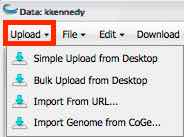
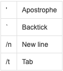

.. include:: cyverse_rst_defined_substitutions.txt
|CyVerse logo|_

|Home_Icon|_
`Learning Center Home <http://learning.cyverse.org/>`_

--------------------
Uploading data items
--------------------

You can upload and import files from your desktop using several different methods:

    - **Simple Upload from Desktop**: Useful for uploading smaller files of up to 1.9 GB per file.
    - **Bulk upload from Desktop**: Upload multiple files using `Cyberduck <https://pods.iplantcollaborative.org/wiki/display/DS/Using+Cyberduck+for+Uploading+and+Downloading+to+the+Data+Store>`_.
    - **Import From URL**: Allows you to past a URL to the file to upload. 

Network bandwidth and current load impacts upload times. For more information on larger files and allocations, see `Downloading and Uploading Data <https://wiki.cyverse.org/wiki/display/DS/Downloading+and+Uploading+Data>`_.

You can also `import files from URL <https://wiki.cyverse.org/wiki/display/DEmanual/Uploading+and+Importing+Data+Items+Within+the+DE#UploadingandImportingDataItemsWithintheDE-importURL>`_ that are larger than 3-4 GB or are not on your computer.

Using Simple Upload from Desktop
--------------------------------

Simple Upload from Desktop is useful when you have smaller files of up to 1.9 GB per file.

    1. Open the **Data** window.
    2. In your personal folder, open the destination folder for the upload. 
    3. Click **Upload** and then click **Simple Upload from Desktop**.
    4. Verify the destination folder (Uploading to) is correct.
        
        .. image:: img/DataSimpleUpload.jpg

        To change the destination folder, click **Cancel**, select the correct folder, and then click **Upload** and **Simple Upload from Desktop** again.
    
    5. In the Upload window, click **Browse** to select the first file to upload.
    6. Repeat for each file to upload. 
    7. Click **Upload**. The files are uploaded to the destination folder. 

Using Bulk Upload from Desktop
------------------------------

Mac and Windows should us `Cyberduck <https://wiki.cyverse.org/wiki/display/DS/Using+Cyberduck+for+Uploading+and+Downloading+to+the+Data+Store>`_ for downloading bulk files, where Linux users may want to use `iDrop Desktop <https://pods.iplantcollaborative.org/wiki/display/DS/Using+iDrop+Desktop>`_ or `iCommands <https://pods.iplantcollaborative.org/wiki/display/DS/Using+iCommands>`_.
You also may still upload or import files within the DE using `simple upload or import from URL <https://pods.iplantcollaborative.org/wiki/display/DEmanual/Uploading+and+Importing+Data+Items+Within+the+DE>`_ within the DE. The method you use depends on the size and number of your data files, as well as your personal preferences. 

You can access and manage data from outside the DE as well. For more information, see `Downloading and Uploading Data <https://pods.iplantcollaborative.org/wiki/display/DS/Downloading+and+Uploading+Data>`_.

--------------------
Importing data items
--------------------

Importing From URL
------------------

Use Import from URL when you want to import larger files, have some files you want to upload from desktop and some you want to import from URL, or want to import a file to the DE that isn't on your system. 
You can receive (or not receive) an email when the status of your imported data item changes. See `Using the Preferences Menu <https://wiki.cyverse.org/wiki/display/DEmanual/Using+the+Preferences+Menu>`_ for more information.

    1. Copy the URL for the first file to import. 
    2. In your personal folder, select the destination folder for the import. (To create a new folder, see `Create a Folder <https://wiki.cyverse.org/wiki/display/DEmanual/Uploading+and+Importing+Data+Items+Within+the+DE#UploadingandImportingDataItemsWithintheDE-createFolder>`_.)
    3. Click **Upload** and then click **Import from URL**.

    .. image:: img/ImportUrl.png

    4. Paste the URL for the file to import in the first row. 
    5. Repeat for each file to import. 
    6. Click the **Import from URL** button. The files are imported to the destination folder. 
        See `Using the Preferences Menu <https://wiki.cyverse.org/wiki/display/DEmanual/Using+the+Preferences+Menu>`_ for more information for how to set the preference to reciev e an email when the status of your imported item changes.
    

**Password Help**

    - If you are importing from an FTP URL that requires authentication, be sure to include your FTP username and password (not your CyVerse username and password) in the URL, as described `here <https://www.cs.rutgers.edu/~watrous/user-pass-url.html>`_. 
    - If your password contains special characters, you may have to `convert to percent encoding <https://www3.trustwave.com/support/kb/article.aspx?id=14938>`_ first.

Importing a Genome from CoGe
----------------------------

You can upload a genome directly from CoGe for use in the DE. THe genome is imported to the **coge_data** folder in your personal Data folder. 

    1. In the Data window, click **Upload** and then click **Upload Genome from CoGe**:

    .. image:: img/ImportGenomeFromCoGe.jpg

    The organism name, version, chromosone count, and sequence type are displayed. To sort any of the columns, click the column header.

    2. Click to select the genome to upload and then click **Import**.
       You will recieve an email when the genome has completed importing to your **coge_data** personal Data folder. 

------------------
Useful information
------------------

About status updates
--------------------

As the import profresses, you recieve several updates in the form of popups, `notifications <https://wiki.cyverse.org/wiki/display/DEmanual/Viewing+and+Deleting+Notifications>`_, and emails. Once you have received notification that your file has been successfully imported, it is available in the destination folder.

**If the window isn't updating...**
    - It may take up to 30 minutes for the window to be updated. Refresh your browser window to see if the changes have taken effect. 

Troubleshooting tips
--------------------

If you experience issues with uploading or importing in the DE, try the following:

    - Check that the file or folder name does not contain any special characters. For more information, see **Using Special Characters in the DE** below.

    - Go to `Ask CyVerse <http://ask.cyverse.org/>`_ and search on upload or import.
        - `This question <http://ask.cyverse.org/question/1989/i-am-not-able-to-upload-my-files-into-data-folder-in-discovery-enviroment/>`_ may help you too.

For additional assistance, please `contact CyVerse Support <support@cyverse.org>`_.

----------------------------------
Using Special Characters in the DE
----------------------------------

If you intend to use a data file in an analysis submitted through the DE, you should rename files previously imported or uploaded through the CyVerse Data Store containing these characters before using them in an analysis submitted in the DE. 
Data file names, folder names, and analysis names containing special characters or spaces have been known to cause failed analyses in the DE, and may return empty or no output files.

Special characters to avoid
---------------------------

Files, folder names, or analysis names cannot contain the following special characters or any special characters on a non-English keyboard:

In addition, it is recommended that you avoid the use of **spaces** in the file names, folder names, and analyses of names used in the DE.

Prohibited special characters
-----------------------------

The following characters are prohibited in files or folders uploaded via the Data Store and will be displayed in red italics to indicate they are not accessible:

    

----

**Fix or improve this documentation:**

- On Github: |Github Repo Link|
- Send feedback: `Tutorials@CyVerse.org <Tutorials@CyVerse.org>`_
- Live chat/help: Click on the |intercom| on the bottom-right of the page for questions on documentation

----

|Home_Icon|_
`Learning Center Home <http://learning.cyverse.org/>`_

.. Comment: Place Images Below This Line
   use :width: to give a desired width for your image
   use :height: to give a desired height for your image
   replace the image name/location and URL if hyperlinked

 .. |Clickable hyperlinked image| image:: ./img/IMAGENAME.png
    :width: 500
    :height: 100
 .. _CyVerse logo: http://learning.cyverse.org/

 .. |Static image| image:: ./img/IMAGENAME.png
    :width: 25
    :height: 25

.. Comment: Place URLS Below This Line

   # Use this example to ensure that links open in new tabs, avoiding
   # forcing users to leave the document, and making it easy to update links
   # In a single place in this document

   .. |Substitution| raw:: html # Place this anywhere in the text you want a hyperlink

      <a href="REPLACE_THIS_WITH_URL" target="blank">Replace_with_text</a>

.. |Github Repo Link|  raw:: html

   <a href="FIX_FIX_FIX_FIX_FIX_FIX_FIX_FIX_FIX_FIX_FIX_FIX_FIX_FIX_FIX" target="blank">Github Repo Link</a>
