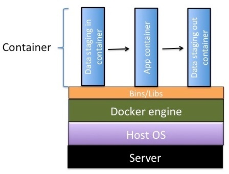

.. include:: cyverse_rst_defined_substitutions.txt
|CyVerse logo|_

|Home_Icon|_
`Learning Center Home <http://learning.cyverse.org/>`_

============================================================
Dockerizing Your Tools for the CyVerse Discovery Environment
============================================================

----------
Background
----------

It is common to build new analysis methods utilizing multiple programs, libraries, and modules, e.g., SAMtools or R with Bioconductor. Often you need very specific versions of the operating system and underlying programs, such as Ubuntu version 14.04, Bioconductor version 3.2, R version 3.2.2, and SAMtools 1.3, to correctly achieve desired results.

This delicate balance of dependencies is often called the “`Software Dependency Hell <https://en.wikipedia.org/wiki/Dependency_hell>`_”. It adversely impacts reproducibility of analyses and makes it very challenging to share your programs, pipelines, and analysis methods with collaborators and users who do not have access to identical systems, i.e., the same versions of all underlying software and operating system.

These issues have made it challenging for users to integrate new applications and analysis methods in the Discovery Environment (DE), as the underlying execution platform could only support a limited number of versions of the same software, e.g., if your program expects to find the BWA program version 0.7.12 in /usr/local/bin/bwa, and another program expects 0.7.13, it was impossible for these to coexist without modifications to your code. With advances in container technology, these issues are now very easy to resolve, and support highly customized execution environments for every analysis. CyVerse is making use of Docker, one of the popular containerization platforms.

---------------
What is Docker?
---------------

Docker, a type of virtualization for software distribution, has revolutionized the way in which scientific software and all dependencies can be packaged, distributed, and deployed. Docker makes the complex and time-consuming installation procedures needed for scientific software a one-time process. Because it enables platform-independent installation, easy versioning of software and redeployment, and reproducibility across environments and versions, Docker is an ideal candidate for the deployment of software on different compute environments (XSEDE, Amazon AWS, etc.). `Learn more about Docker <https://www.docker.com/whatisdocker>`_.

**Glossary**

    - **Docker image**: Ready snapshot of a configured software application.
    - **Docker container**: Instance of a Docker image.
    - **Dockerfile**: Set of instructions/commands that are used to build the Docker image.
    - **Docker engine**: Docker tool that simplifies the creation of Docker hosts on your computer.  
    - **CyVerse tools vs. apps**: In the DE, a tool is an executable or binary upon which an app (an interface of a tool) is used to run the analyses. Before a new app can be created, the appropriate version of the underlying tool must be installed in the DE. Use Docker to create a tool. After that tool is installed on the DE, you use it to create an app. Your app can be private or public.

------------------------------
Using Docker in the CyVerse DE
------------------------------

CyVerse has adopted Docker for integrating software apps that run in the CyVerse DE’s Compute Cluster (Condor). The user creates a Dockerfile, which is used to build the Docker image containing the tool that will be used as an app in the DE.

Integrating a Dockerized tool into the DE enables users to begin creating apps built on the tool. Because Dockerized apps use fewer resources, their analyses process more quickly. Compared to the previous method for tool integration in the DE, this method streamlines the process and makes it more likely that the final DE app will function as the user intended. It also increases the likelihood that more complicated and difficult to install software can be used in the DE.

**Figure 1. CyVerse container architecture**

About Docker containers
-----------------------

**Docker engine**: The Docker engine shown in Figure 1 runs on three different containers in the DE. This spreads out the resources so that updates to the tool are easier to do, making it easy for users to move data in and out of the Docker containers.

    - The **data staging-in container** delivers the data on which you want to operate to its location in the Data Store.

    - The **app container**, based on your integrated Dockerized tool, runs with the data visible to it as a union file system.

    - The **data staging-out container** returns data from the analysis that uses the app to the Data Store.

Video Tutorial
--------------

For a step-by-step tutorial on how to create Docker images, see `this video webinar <https://wiki.cyverse.org/wiki/display/Events/Focus+Forum+Webinar+-+Using+Docker+to+Bring+Tools+into+the+Discovery+Environment>`_ and `the documentation page <https://github.com/upendrak/docker-webinar-1/blob/master/demo-2.md>`_ that accompanies it.

--------------------------------------
Steps for Dockerizing a tool in the DE
--------------------------------------

Prerequisites
-------------

Before you can use a Dockerized image, you must complete a few prerequisites:

    1. **Install Docker and any other dependencies**:

        - Linux: The `installation procedure <https://docs.docker.com/engine/installation/>`_ involves the use of package containers, such as Curl, or the use of APT (Advanced Package Tool) and Yum repositories for your installation.
        - Mac OS X and Windows: `Docker Toolbox <https://www.docker.com/toolbox>`_ is a quick and easy way to install and set up a Docker environment.
        - Virtual Machine: Docker can be installed in a virtual machine environment through `Virtual Box <https://pods.cyverse.org/wiki/display/HDFDE/Installing+VirtualBox%2C+Ubuntu%2C+and+Docker>`_.
        - GUI: Docker containers can also be run through a simple and powerful graphical user interface such as `Kitematic <https://kitematic.com/>`_.

    2. **Ensure the tool you want to Dockerize is available from a reliable source**: A reliable source is a website that hosts files/binaries necessary for tool installation and which can relied upon for future builds (for example, ubuntu apt repos, redhat/centos yum repos). Unreliable sources  include a public Dropbox link, a lab computer, a personal computer, etc.

        - If the tool and all its executables are available on reliable sources, use that URL for Dockerization of the tool.
        - If installation files cannot be retrieved from a reliable source, they should be version controlled with the Dockerfile.

Steps
-----

.. image:: img/Docker_process_DEPage 1.png
**Figre 2. Flow diagram of Dockerization of tools in the DE**

The following steps serve as a guide for Dockerizing a tool in the DE (see Figure 2 below).

Step 1: Check if the tool and correct version are already installed in the DE.
------------------------------------------------------------------------------

Before requesting installation of a new tool or new version of an existing tool, `check the list of all tools in the DE <https://wiki.cyverse.org/wiki/display/DEmanual/Finding+the+List+of+Available+Tools>`_ to make sure that the tool and version you want is not already available. Because all tools now run inside a Docker containers and are installed as Docker images in the DE, if the tool is not already available, you must first create a Dockerfile for the tool before requesting its installation in the DE.

Step 2: Create the Dockerfile following best practices.
-------------------------------------------------------

Construction of each tool's image needs to be reviewed in order to ensure that its construction is **as repeatable as possible**, as well as ensuring that execution of each tool is **as repeatable and reliable as possible**. The Dockerfile satisfies this goal of documenting how a particular tool was installed and of making the tool construction repeatable. To do so, use the following guidelines:

    - Adhere to the `Docker community specific set of instructions <https://docs.docker.com/engine/reference/builder/>`_.
    - Additionally, here are few CyVerse Dockerfile best practices:
        - **Include all installation steps in the Dockerfile**. For example, a Dockerfile should not copy and run a script that performs Ubuntu APT commands; instead, the APT commands should be in the Dockerfile.
        - **Write the Dockerfile to fail-fast**. This means that if anything goes wrong, construction of the image will fail.
        - **Encapsulate the tool execution** to avoid external dependencies unless by design (e.g., tool provides integration with external service).
        - **Derive the tools from** `official Docker images <https://hub.docker.com/explore/>`_.
        - **Specify an** `ENTRYPOINT in your Dockerfile <https://docs.docker.com/engine/reference/builder/#entrypoint>`_. The entry point will allow the docker image to be run similar to an executable. Alternatively, you can also provide an entry point later when adding your tool to the Discovery Environment.

**Examples of good Dockerfiles**

Two simple examples of good Dockerfiles are shown below.
Additionally, take a look at the list of `commonly used CyVerse base images <http://hammer.cyverse.org:8090/display/DEmanual/Dockerizing+Your+Tools+for+the+CyVerse+Discovery+Environment#DockerizingYourToolsfortheCyVerseDiscoveryEnvironment-CommonBaseImages>`_ in the FAQ section below, and the troubleshooting tips in the `Docker cheat sheet <https://github.com/wsargent/docker-cheat-sheet>`_.

Sample Dockerfile 1: hisat2
---------------------------

Dockerfile for installing `hisat2 <https://github.com/infphilo/hisat2>`_ in a Docker container based on the Ubuntu:14.04.03 image: 

.. code-block:: bash

    FROM ubuntu:14.04.3
    MAINTAINER Eric Lyons
    RUN apt-get update && apt-get install -y \
        build-essential \
        git \
        python
    ENV BINPATH /usr/bin
    ENV SRCPATH /usr/src
    ENV HISAT2GIT https://github.com/infphilo/hisat2.git
    ENV HISAT2PATH $SRCPATH/hisat2
    RUN mkdir -p $SRCPATH
    WORKDIR $SRCPATH
    # Clone and checkout the 2.0.3-beta release version of the git repo
    RUN git clone "$HISAT2GIT" \
        && cd $HISAT2PATH \
        && git checkout 3f8c81375700d4107fdfd1caeaec01b5719ae4b8
    RUN  make -C $HISAT2PATH \
        && cp $HISAT2PATH/hisat2 $BINPATH \
        && cp $HISAT2PATH/hisat2-* $BINPATH
    ENTRYPOINT ["/usr/bin/hisat2"]

Sample Dockerfile 2: NCBI SRA Submission pipeline
-------------------------------------------------

Dockerfile for installing NCBI SRA Submission in a Docker container based on a python:2.7 base image.

.. code-block:: bash

    FROM python:2.7-slim
    WORKDIR /root
    COPY requirements.txt ./
    RUN set -x \
        && apt-get update \
        && apt-get install -y gcc libxml2-dev libxslt1-dev lib32z1-dev --no-install-recommends \
        && rm -rf /var/lib/apt/lists/* \
        && pip install -r requirements.txt \
        && apt-get purge -y --auto-remove gcc lib32z1-dev
    # Download Aspera Connect client from http://downloads.asperasoft.com/connect2/
    ADD http://download.asperasoft.com/download/sw/connect/3.5/aspera-connect-3.5.1.92523-linux-64.sh aspera-connect-install.sh
    # Install Aspera Connect client to ~/.aspera
    RUN chmod 755 aspera-connect-install.sh
    RUN ./aspera-connect-install.sh \
        && rm aspera-connect-install.sh
    COPY ncbi_sra_submit.py metadata_client.py ncbi_sra_report_download.py ./
    VOLUME [ "/root/config", "/root/templates", "/root/schemas" ]
    ENTRYPOINT [ "python", "/root/ncbi_sra_submit.py" ]
    CMD [ "--help" ]

**Why are these good Dockerfiles?** Both Dockerfiles adhered to best practices by using official Docker images and installing the tool from a reliable source.

**Example of a poor Dockerfile**
Here is a hypothetical example of how a poor Dockerfile looks like. Let's assume we have a tool named FooBar. 

.. code-block:: bash

    FROM test/Ubuntu
    RUN apt-get upgrade
    RUN apt-get update
    RUN apt-get install -y emboss python
    RUN wget https://someuniversity.edu/test_tool/test.py

**Why is this a poor Dockerfile?** It used an untested/unofficial Docker image. It contains a step that fetches binaries from some server at a university.

In addition, no fail-fast was written to the Dockerfile. At some point in time, this server was taken offline, despite assurances that it would remain online forever. This causes the image build to fail because its binaries cannot be retrieved, and no errors were written to the Dockerfile.

Step 3: Build and test the Dockerized tool.
-------------------------------------------

Before you request the installation of the Dockerized tool:

- **Build a new image**: Use `docker build <https://docs.docker.com/engine/reference/commandline/build/>`_ command as shown below to test your new image:

.. code-block:: bash

    docker build -t <your/docker-image> .

- **Test the new image**: Use `docker run <http://docs.docker.com/engine/reference/commandline/run/>`_ command as shown below to test your new image:

.. code-block:: bash

    docker run --rm <your/docker-image> <entrypoint arguments>

- **Test the inputs and outputs**. Your tool will most likely require inputs and produce outputs. A `docker run <http://docs.docker.com/engine/reference/commandline/run/>`_ command like the following example should be used to ensure your tool will run inside the DE. If the tool's image was built from a `Dockerfile <http://docs.docker.com/engine/userguide/dockerimages/#building-an-image-from-a-dockerfile>`_ with an `ENTRYPOINT <http://docs.docker.com/engine/reference/builder/#entrypoint>`_ and `tagged <http://docs.docker.com/engine/reference/commandline/tag/>`_ your/docker-image, then place some test input files into a scratch directory (~/my-scratch-dir in this example), and run a command like the following:

.. code-block:: bash

    docker run --rm -v ~/my-scratch-dir:/working-dir -w /working-dir your/docker-image user-input-1 user-input-2 ...

The `-v option <https://docs.docker.com/userguide/dockervolumes/#mount-a-host-directory-as-a-data-volume>`_ mounts the scratch directory on the host machine into that /working-dir directory inside the container, and the `-w option <https://docs.docker.com/reference/run/#workdir>`_ sets the working directory inside the container to that same /working-dir directory.

    - **Note**: The DE will run a tool's Docker image, using a combination of the `docker run <http://docs.docker.com/engine/reference/commandline/run/>`_ flags `-w <https://docs.docker.com/reference/run/#workdir>`_ and `-v <https://docs.docker.com/userguide/dockervolumes/#mount-a-host-directory-as-a-data-volume>`_ in order to mount the Condor node's working directory to some arbitrary working directory inside the container. All inputs will be placed inside this working directory, and the DE expects the tool to generate outputs under this working directory as well.
    - Additionally, all arguments entered by the user in the DE's app interface will be passed as command-line arguments to the `docker run <http://docs.docker.com/engine/reference/commandline/run/>`_ command following the your/docker-image image name. From the example command above, these would be user-input-1 user-input-2 ... Exceptions are the `Environment Variable fields <https://pods.iplantcollaborative.org/wiki/display/DEmanual/Adding+Text%2C+Integer%2C+Checkbox%2C+and+Variable+Input+Fields+to+Your+App#AddingText,Integer,Checkbox,andVariableInputFieldstoYourApp-Environmentvariablefields>`_, which will be passed to the `docker run <http://docs.docker.com/engine/reference/commandline/run/>`_ command as  `-e <http://docs.docker.com/engine/reference/commandline/run/#set-environment-variables-e-env-env-file>`_  flags.
    - Also note that `Reference Genome/Sequence/Annotation <http://hammer.cyverse.org:8090/display/DEmanual/Adding+Reference+Genome%2C+Sequence%2C+and+Annotation+Fields+to+Your+App>`_ input arguments are passed to the tool differently from other arguments, so if your tool requires these types of inputs, please include that requirement on the form when you `request installation <http://hammer.cyverse.org:8090/display/HDFDE/Request+Docker+image+install+at+iPlant>`_.

If the tool's container produced outputs in that host's scratch directory, then this tool is ready for the next step (Request installation of the Dockerized tool in the DE).

Step 4: Request installation of the Dockerized tool.
----------------------------------------------------

Read the main steps in the DE user manual for `submitting your request for installation of the new tool <https://wiki.cyverse.org/wiki/display/DEmanual/Adding+or+Requesting+a+New+Tool>`_ (executable) in the DE. Once the tool is installed, you will receive an email notification.

As noted in the previous step, if your tool requires Reference Genome/Sequence/Annotation input arguments, note that in your request.

Step 5: Create and save the new app interface in the DE.
--------------------------------------------------------

Once the Dockerized tool is installed, go to the CyVerse DE manual to learn how to `design a new interface <https://cyverse-de-manual.readthedocs-hosted.com/en/latest/new-appInterfacechildpages/designingInterface.html>`_, `preview it <https://cyverse-de-manual.readthedocs-hosted.com/en/latest/new-appInterfacechildpages/PreviewAppJson.html>`_, and **save the new app** within the DE.

Step 6: Test your app in the DE.
--------------------------------

After creating the new app according to your design, test your app in the DE to make sure it works properly.

If your app works the way you expect it to, skip to Optional steps.
If your app still needs a bit of work and If the changes you make affect your Dockerfile (for example, it uses a newer version of the software and subsequently new dependencies are created), go back to step 2 and repeat.

----

**Fix or improve this documentation:**

- On Github: |Github Repo Link|
- Send feedback: `Tutorials@CyVerse.org <Tutorials@CyVerse.org>`_
- Live chat/help: Click on the |intercom| on the bottom-right of the page for questions on documentation

----

|Home_Icon|_
`Learning Center Home <http://learning.cyverse.org/>`_

.. Comment: Place Images Below This Line
   use :width: to give a desired width for your image
   use :height: to give a desired height for your image
   replace the image name/location and URL if hyperlinked

 .. |Clickable hyperlinked image| image:: ./img/IMAGENAME.png
    :width: 500
    :height: 100
 .. _CyVerse logo: http://learning.cyverse.org/

 .. |Static image| image:: ./img/IMAGENAME.png
    :width: 25
    :height: 25

.. Comment: Place URLS Below This Line

   # Use this example to ensure that links open in new tabs, avoiding
   # forcing users to leave the document, and making it easy to update links
   # In a single place in this document

   .. |Substitution| raw:: html # Place this anywhere in the text you want a hyperlink

      <a href="REPLACE_THIS_WITH_URL" target="blank">Replace_with_text</a>

.. |Github Repo Link|  raw:: html

   <a href="FIX_FIX_FIX_FIX_FIX_FIX_FIX_FIX_FIX_FIX_FIX_FIX_FIX_FIX_FIX" target="blank">Github Repo Link</a>
