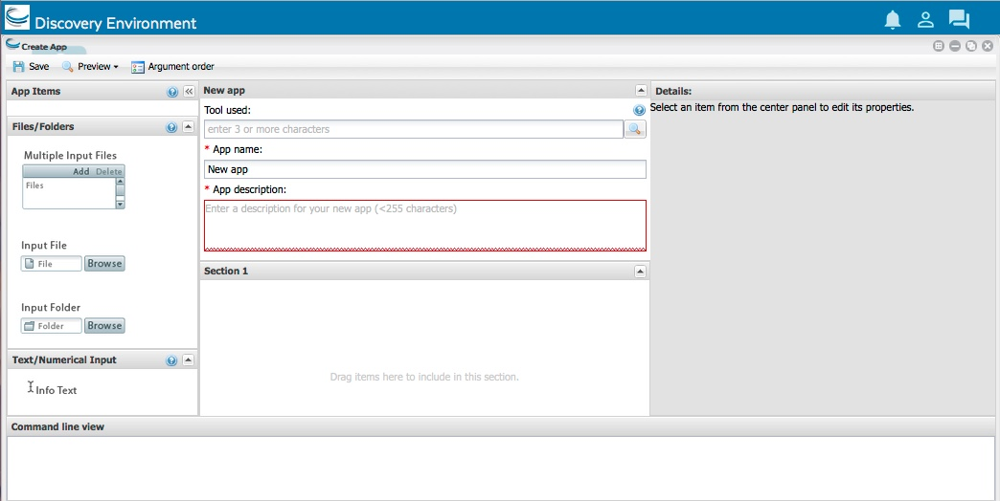
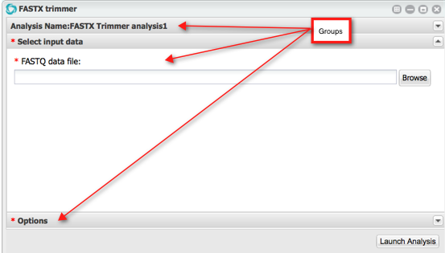
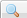
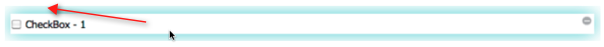
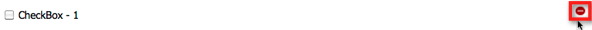

.. include:: cyverse_rst_defined_substitutions.txt
|CyVerse logo|_

|Home_Icon|_
`Learning Center Home <http://learning.cyverse.org/>`_

=======================
Designing the Interface
=======================

About the Create App window
---------------------------

The Create App window consists of four distinct sections:

    - The section on the left side contains the different app items that can be added to your interface. To add an app item, select the one to use (hover over the object name for a brief description) and drag it into position in the middle section.
    - Once dropped into a group, the properties that are available for that type are displayed in the Properties section on the right. As you add and design the argument, the Command line view section at the bottom of the window displays the commands for the object, and the middle section updates interactively to display the argument. You can also preview it to see how the whole app looks and functions.
    - The middle section is the landing place for the objects you dragged and dropped from the left section, and it updates to display how the object looks as you define it in the Details section on the right.
    - The **Details** section on the right displays all of the available properties for the selected item. As you customize the app in the Details section, the middle section updates dynamically so you can see how it will look and act.
    - The **Command line view** at the bottom contains the command-line commands for the current item's properties. As you update the properties in the Details section, the Command line view updates as well.
    - At the top of the window are icons to save the app, preview the UI or JSON script, and set the argument order.

About designing the interface
-----------------------------

Creating a new app interface is a basic process. You'll need to know how to use the tool — the executable or binary upon which the app is based. With that knowledge, you create the interface according to how you want it to be used in the DE.

An app interface in the DE is arranged in a hierarchy of two main pieces:
    
    - The framework consists of one or more **groups**. A group creates a conceptual boundary in the interface into which you add the relevant user input settings in the order and with the field names you want, as displayed when the app is viewed in the DE. For example, many DE apps have a first panel called *File Inputs*.
    - Inside each group, you add those user interface objects you need to facilitate the collection of user inputs. There are a number of different user interface objects from which to select, including input file fields, selection and checkbox fields, text and numerical input fields, and output file fields.

In the following example, we see three groups, with the **Select input data** group, as defined by the integrator, expanded:

Next Steps
----------

See this section to help you design the interface:

-------------------------------------
Selecting the Tool and Naming the App
-------------------------------------

Whether creating a new app or editing an existing one, the first step in the process is selecting the tool used for the app, and entering or editing the app name and description.

    1. `Open the Create Apps window. <https://wiki.cyverse.org/wiki/display/DEmanual/Creating%2C+Copying%2C+and+Editing+DE+Apps>`_

    2. If necessary, click the **New app** (or current app name) panel header to open the section.

    .. image:: img/CreateApps-1a.png

    3. In the **Tool used** field, click |BrowseButton|, and then enter at least 3 characters of the app name.

    .. tip:: To indicate a version of your app or that this is an HPC app, you can add opening and closing parentheses in the app name.

    4. To view the attribution and description of the tool, click the app name, then click |CloseWindow| to close.

    .. tip:: Tool or version not listed? 
            Click **New Tool Request** and `request that a new tool or version be installed <https://wiki.cyverse.org/wiki/display/DEmanual/Adding+or+Requesting+a+New+Tool>`_.

    5. Select the tool and click **OK**.

    6. In the App name field, enter a unique name for the app.

    7. In the **App description** field, enter a brief description. The description will be displayed when viewing the `app information <https://wiki.cyverse.org/wiki/display/DEmanual/Viewing+App+and+Tool+Information>`_ section in the Apps list.

    8. Click **Save**.

-------------------------------
Adding and Editing App Sections
-------------------------------

Apps are built section by section. By default, the Section 1 section is created when you first create a new app. You can edit the section name, as well as add additional sections and delete sections.

    
    **Editing a section name**

    1. To create a new app, or copy or edit an existing one:

        - To **create a new app or workflow from scratch**, either:
    
            - Open the Apps window, click **Apps** on the toolbar for an app or **Workflow** for a workflow, and then click **Create New**.
    
                or
    
            - Click the tool name from the `Manage Tools <https://wiki.cyverse.org/wiki/display/DEmanual/Managing+Tools+in+the+DE>`_ window.
    
        - To **create your own version or edit one you already published**, select the app or workflow in the **Public Apps** folder, click either **Apps** or **Workflow**, and then click **Copy**.
    
        - To **edit an unpublished app or workflow** you are working on, select the app or workflow in your **Apps under development** folder, click either **Apps** or **Workflow**, and then click **Edit**.
    
    2. In the middle section, click the header bar for the section name to edit:

    .. image:: img/CreateAppSection.png

    3. In the Details section on the right, click in the **Section name** field and edit the section name label.

    4. Click **Save**.

    
    **Adding a new section**
    

    1. In the Create Apps window for the app, click and drag the Section object in the App Items section on the left to the target position in the selected group:

    .. image:: img/Createapp_AddInputGroup.png

    2. In the Details section, edit the section name label.
    3. Click **save**

    
    **Deleting a section**
    

    1. In the Create Apps window for the app, click the header bar of the section to delete.
    2. In the Details section, click **Delete section**:

    .. image:: img/DeleteSection.png

-------------------------------------------------------------
Adding and Deleting File and Folder Input Fields for Your App
-------------------------------------------------------------

You can add fields for multiple input files, single files, or folder input fields when creating or editing an app interface.

**Adding input fields**

    
    **Step 1: Select the section**
    

    1. To create a new app, or copy or edit an existing one:

        - To **create a new app or workflow from scratch**, either:
    
            - Open the Apps window, click **Apps** on the toolbar for an app or **Workflow** for a workflow, and then click **Create New**.

             or

            - Click the tool name from the `Manage Tools <https://wiki.cyverse.org/wiki/display/DEmanual/Managing+Tools+in+the+DE>`_ window.

        - To **create your own version or edit one you already published**, select the app or workflow in the **Public Apps** folder, click either **Apps** or **Workflow**, and then click **Copy**.
        
        - To **edit an unpublished app or workflow** you are working on, select the app or workflow in your **Apps under development** folder, click either **Apps** or **Workflow**, and then click **Edit**.
    
    2. In the app, click the section header to expand the section into which you want to add the input field.

    
    **Step 2: Select the input field type to add**
    

    - **Multiple Input Files field**: Allows the user to select multiple files, with the ability to specify the type of file that may be added to the list, as shown:

    .. image:: img/CreateApp_MultiInputFiles.png

    - **Input File field**: Allows the user to select one input file, as shown:

    .. image:: img/CreateApp_InputFile-2.png

    - **Input Folder field**: Allows the user to select one input folder, as shown:

    .. image:: img/CreateApp_FolderSelector.png

    
    **Step 3: Edit the Details section in the right panel**
    

.. role:: rubric

The properties displayed in the Details panel vary according to which input type you selected.

    Click the field in the middle section to edit its properties in the Details section on the right.

    - **Selector label**: Edit the label as you want it to be displayed in the app.
    - **Argument option**: Enter the command line option according to the tool's requirements.
    - **Make this field required**: Select to require the user to select at least one input folder.
    - **Exclude this item if nothing is entered**: Click this option if you want to skip this file type when nothing is entered in the app.
    - **Tool tip text**: Enter text to inform the user about how to use the field when viewed in the app.
    - **Type of information contained in these files**: Select the type of file that can be included in the folder, or leave Unspecified to allow more than one file type.
    - **Do not pass this argument to command line**: Allows the user to select input files without including those files in the command line.
    - **Repeat "Argument option" on the command line before each filename** *:rubric:`(Multiple Input Files only)`*: Includes the select input files in the command line before each filename selected by the user.

    
    **Step 4: Preview and save**
    

    1. Click **Preview** and then click **Preview UI**.

    2. When done, close the Preview window.

    3. Click **Save**.

**Deleting file or folder fields**

    .. |deleteicon| image:: img/Createapp_DeleteArgumentIcon.png

    1. In the middle section, click in the field to delete. A blue border around it is displayed around the field:

    .. image:: img/CreateApp_DeleteCheckbox1.png

    2. Hover over the the gray |deleteicon| icon at the top right until it turns red:

    .. image:: img/CreateApp_DeleteCheckbox2.png

    3. Click the icon to complete the deletion.
    4. Click **Save**.

------------------------------
Adding List Fields to Your App
------------------------------

You can add several different types of list fields to your app.

    .. list-table::
        :header-rows: 0

        * - List
          - List field from which the user can select one list item
        * - Integer List
          - List of integers from which the user can select one integer item
        * - Decimal List
          - List of decimals from which the user can select one decimal item
        * - List Tree  
          - List field into which list items can be added in hierarchical order, with ability to select only one or multiple items

    
    
    **Step 1: Open the Create or Edit Apps window and select the section.**
    

    1. To create a new app, or copy or edit an existing one:

        - To **create a new app or workflow from scratch**, open the Apps window, click **Apps** on the toolbar for an app or **Workflow** for a workflow, and then click **Create New**.
        - To **create your own version or edit one you already published**, select the app or workflow in the **Public Apps** folder, click either **Apps** or **Workflow**, and then click **Copy**.
        - To **edit an unpublished app or workflow** you are working on, select the app or workflow in your **Apps under development** folder, click either **Apps** or **Workflow**, and then click **Edit**.
    
    2. Click the section header to expand the section into which you want to add the list field.

    
    **Step 2: Select the list type to add**
    

    **List, Integer List, and Decimal List Fields**

    1. Select the list type to use, either List, Integer List, or Decimal List.
    
    2. Click and drag the list object from the Lists section on the left to the expanded section in the middle.
    
    3. Click in the Label field to display its details on the right.

        - **Label**: Edit the label as you want it to be displayed in the app.
        - **Default item to display**: After entering the list in the step below (Edit list button), select the default item for the list.
        - **Make this field required**: Select to require the user to select at least one item in the list.
        - **Exclude this item if nothing is entered**: Click this option if you want to skip this list when nothing is entered in the app.
        - **Tool tip text**: Enter text to inform the user about how to use the field when viewed in the app.
    
    4. To add a list item:

        a. Click **Edit list**.
        b. In the Edit list window, click **Add**.
        c. Double-click in the **Display** column, edit the display name of the list item, and click **Save**.
        d. Double-click in the **Argument** column, enter the command-line command according to the tool's requirements, and click **Save**.
        e. Double-click in the **Value** column, enter the value for the list item, and click **Save**.
        f. Repeat for each item in the list.
        g. Click **Done**.

    
    **List Tree (hierarchical lists) fields**
    

    1. In the Lists section on the left, click and drag the **List Tree** item to the location in the selected section.
    2. Click in the List Tree Label field to display its details on the right.
    3. In the Details section on the right:

        - **Tree List label**: Edit the label as you want it to be displayed in the DE.
        - **Make this field required**: Select to require the user to select at least one item in the list.
        - **Exclude this item if nothing is entered**: Skips the item if no item is selected.
        - **Tool tip text**: Edit as needed.
    
    4. Click **Edit hierarchical** list to open the Edit list window:
    
        - **Check Cascade** determines how the list functions when a user takes action upon a section or field. By combining the cascade option with the Single selection only option, you can allow the user to select only one list item, one or more list items, or all list items. Select the cascade option to use:

         .. list-table::
            :header-rows: 1

            * - **Cascade type**
              - **When parent is selected**
              - **When only a child**
              - **With Single Selection Only option**
            * - **Both**
              - Selects parent and all its children (default)
              - Selects only the checked child or children; highlights parent to indicate a selected child
              - Able to select only one child
            * - **Parent**
              - Selects only the parent
              - Selects both that child or children and its parent
              - Selects only the checked child and its parent
            * - **Children**
              - Selects both the parent and all its children
              - Selects only the checked chil
              - Able to select only one child
            * - **None**
              - Selects only the parent
              - Selects only the checked child
              - Able to select only the parent or only one child

        
        - **Single selection only**: Allows the user to select only one item in the list. When used in combination with the Check Cascade method, it is possible to specify the list items that may be selected.

        - **To add a group**:

            a. Click |create_app|.
            b. Click in the **Display** cell to edit the group name.
            c. Click in the Argument cell to enter the argument, according to the tool's requirements.
            d. Click in the Value to enter the value of the folder.
            c. Click in the Tool tip text cell to enter the tool tip text for the group.
            d. Repeat for each group to add.

        .. tip::
            To add a new group after you have added a list item, click **Command+Click** (Mac) or **Control+Click** (PC) to deselect the group, or you can drag the new group out to the desired level.

        - **To add an argument (list item)**:

            a. Select the group into which you want to add the list item.
            b. Click |AddArg|.
            c. Click in the Display cell to edit the list item name.
            d. Click in the Argument cell to enter the argument, according to the tool's requirements.
            e. Click in the Value cell to enter the value of the item.
            f. Click in the Tool tip text cell to enter the tool tip text.
            g. Repeat for each argument to add.

        - **To set the default group or argument**, select the item and then click the checkbox in the Default column.
            
        - **To delete a group or argument**:

            a. Click the group or argument to delete.
            b. Click |DeleteIcon|.
            c. Repeat for each group or list item to delete.

    5. When done entering list tree items, click **Done**.
    6. Click **Preview** and then click **Preview UI**. When done, close the Preview window.
    7. Click **Save**.

---------------------
Deleting a list field
---------------------

1. In the middle section, hover over the item to delete until you see a blue border around the object:

2. Hover over the gray |graydelete| icon at the top right until it turns red.

3. Click the icon to complete the deletion.
4. Click **Save**.

---------------------------------------------------------------------
Adding Text, Integer, Checkbox, and Variable Input Fields to Your App
---------------------------------------------------------------------

Adding Text, Integer, Checkbox, and Variable Input Fields to Your App

    
**About adding text, integer, checkbox, and variable input fields**
    

    You can choose from several different types of text and numerical input fields:

    .. list-table::
        :header-rows: 1

        * - **Field Type**
          - **description**
          - **Define Default Value?**
          - **Set Validation Rules?**
        * - Info Text
          - Textbox into which the integrator can enter informative or descriptive text about the section or field
          - No
          - No
        * - Single-line Text
          - Textbox into which the user can enter one line of text
          - Yes
          - Yes
        * - Multi-line Text
          - Textbox into which the user can enter multiple lines of text
          - Yes
          - No
        * - Checkbox
          - Checkbox option
          - Yes
          - No
        * - Environment Variable
          - Environment variable that the user can set before running an analysis
          - Yes
          - No
        * - Integer
          - Textbox that checks for valid integer input
          - Yes
          - Yes
        * - Decimal
          - Textbox that checks for valid decimal or large integer input
          - Yes
          - Yes
    

    
    **Info Text**
    

    Inserts a text box into which the integrator can enter informative or descriptive text about a section or field. For example, you can add an info text field to explain how to use the following field.

    
    1. To create a new app, or copy or edit an existing one:
        
        - To **create a new app or workflow from scratch**, either:
            
            - Open the Apps window, click **Apps** on the toolbar for an app or **Workflow** for a workflow, and then click **Create New**.
                or
            - Click the tool name from the `Manage Tools <http://hammer.cyverse.org:8090/display/DEmanual/Managing+Tools+in+the+DE>`_ window.
       
        - To **create your own version or edit one you already published**, select the app or workflow in the **Public Apps** folder, click either **Apps** or **Workflow**, and then click **Copy**.
        - To **edit an unpublished app or workflow** you are working on, select the app or workflow in your **Apps under development folder**, click either **Apps** or **Workflow**, and then click **Edit**.
    2. Click to open the section into which you want to add the info text field.
    3. In the Text/Numerical Input section on the left, click and drag the **Info Text** item to the location in the selected section.
    4. Click in the Info Text Label field to display its Details on the right.
    5. In the Details section, enter the text to display in the information line.
    6. Click **Preview** and then click **Preview UI**. When done, close the Preview window.
    7. Click **Save**.

    
    **Single-line text input fields**
    

    Inserts a text field into which the user can enter a single line of text, with validation either for a maximum number of characters or a regular expression.

    .. image:: img/CreateApp_SingleLineText.png

    1. In the Create Apps window for the app, click to open the section into which you want to add the single-line text input field.
    2. In the Text/Numerical Input section on the left, click and drag the Single-line Text item to the location in the selected section.
    3. Click in the Single-line Text Label field to display its Details on the right.
    4. Edit the Details section:

        - **Text box label**: Edit the label as you want it to be displayed in the DE.
        - **Argument option**: Enter the command line option according to the tool's requirements.
        - **Default text**: Enter the default text string that will be displayed.
        - **Do not display this item in the app**: Hides the field in the GUI.
        - **Make this field required**: Requires the user to enter at least one text string.
        - **Exclude this item if nothing is entered**: Skips the item if no selection was made.
        - **Tool tip text**: Edit as needed.

    5. To add a validation rule for the text string:
        a. Click |AddArg|.
        b. In the Rule Type list, select either:

            - **Value must contain, at most, a maximum number of characters**: Enter the maximum number of characters that may be entered in the text string and then click **OK**.
            - **Matches a regular expression**: Enter the text string that is required and then click **OK**.
        
        c. Repeat for each validation rule to define.
    
    6. To edit a validation rule, click the validation rule in the Validation rules table, click **Edit**, and change the Rule Type or Value, and then click **OK**.
    7. To delete a validation rule, click the validation rule in the Validation rules table and then click **Delete**.
    8. Click **Preview** and then click **Preview UI**. When done, close the Preview window.
    9. Click **Save**.

    **Multi-line text fields**

    Inserts a text input field into which the user can enter multiple lines of text.

    .. image:: img/CreateApp_MultiLineText.png

    1. In the Create Apps window for the app, click to open the section into which you want to add the multi-line text input field.
    2. In the Text/Numerical Input section on the left, click and drag the **Multi-line Text** object to the location in the selected section.
    3. Click in the Multi-line Text Label field to display its Details on the right.
    4. Edit the Details section:

        - **Multi-line Text label**: Edit the label as you want it to be displayed in the DE.
        - **Argument option**: Enter the command line option according to the tool's requirements.
        - **Default text**: Enter the default text strings that will be displayed.
        - **Do not display this item in the app**: Hides the field in the GUI.
        - **Make this field required**: Requires the user to select at least one input file.
        - **Exclude this item if nothing is entered**: Skips the item if no selection was made.
        - **Tool tip text**: Edit as needed.

    5. Click **Preview** and then click **Preview UI**. When done, close the Preview window.
    6. Click **Save**.

    **Checkbox Fields**

    Inserts a checkbox and checkbox label.

    .. image:: img/CreateApp_Checkbox2.png

    1. In the Create Apps window for the app, click to open the section into which you want to add the checkbox.
    2. In the Text/Numerical Input section on the left, click and drag the Checkbox object to the location in the selected section.
    3. Click in the Checkbox Label field to display its Details on the right.
    4. Edit the Details:

        - **Checkbox label**:
            a. Edit the label as you want it to be displayed in the DE.
            b. Enter the argument option and value for the Checked and Not Checked options.
        - **Check item by default**: Defines whether the default state is checked or cleared.
        - **Do not display this item in the app**: Hides the field in the GUI.
        - **Exclude this item if nothing is entered**: Skips the item if no selection was made.
        - **Tool tip text**: Edit as needed.

    5. Click **Preview** and then click **Preview UI**. When done, close the Preview window.
    6. Click **Save**.

    **Environment variable fields**

    Allows the user to enter variables that affect the user's local machine. For more information, see `Environment variable <http://en.wikipedia.org/wiki/Environment_variable>`_ on the Wikipedia website.

    1. In the Create Apps window for the app, click to open the section into which you want to add the argument.
    2. In the Text/Numerical Input section on the left, click and drag the **Environment Variable** object to the location in the selected section.
    3. Click in the Environment Variable Label field to display its Details on the right.
    4. In the Details panel:

        - **Environment Variable label**: Edit the label as you want it to be displayed in the DE.
        - **Environment Variable name**: Displays the name of the environment variable name set by the app before the command line tool is run.
        - **Default value**: Enter the default value for the variable you entered.
        - **Do not display this item in the app**: Hides the field in the GUI.
        - **Make this field required**: Requires the user to enter a variable.
        - **Tool tip text**: Edit as needed.
    
    5. Click **Preview** and then click **Preview UI**. When done, close the Preview window.
    6. Click **Save**.

    **Integer input fields**

    Adds a text field into which the user can enter an integer, with validation for upper limit, lower limit, or range of values.

    .. image:: img/CreateApp_Integer.png

    1. In the Create Apps window for the app, click to open the section into which you want to add the argument.
    2. In the Text/Numerical Input section on the left, click and drag the **Integer** object to the location in the selected section.
    3. Click in the Integer Label field to display its Details on the right.
    4. In the Details section:
        
        - **Integer Input label**: Edit the label as you want it to be displayed in the DE.
        - **Argument option**: Enter the argument to use for the item, according to the tool's requirements.
        - **Default value**: Enter the default value that will be displayed.
        - **Do not display this item in the app**: Hides the field in the GUI.
        - **Make this field required**: Requires the user to enter an integer.
        - **Exclude this item if nothing is entered**: Skips the item if no selection was made.
        - **Tool tip text**: Edit as needed.

    5. To add a validation rule for the integer field:
        a. Click |AddArg|.
        b. In the Rule Type field, select either:

            - **Has a range of allowed values**: Enter the upper and lower values for the entered integer to define the range the user can enter in the field.
            - **Has a lower limit**: Enter the value that must be above the entered integer.
            - **Has an upper limit**: Enter the integer that must be below the entered integer.
        
        c. Click **OK**.
        d. Repeat for each validation rule to define.

    6. To edit a validation rule, click the rule in the table, click **Edit**, change the settings, and click **OK**.
    7. To delete a validation rule, click the rule in the table and then click **Delete**.
    8. Click **Preview** and then click **Preview UI**. When done, close the Preview window.
    9. Click **Save**.

    **Decimal input fields**

    Adds a field into which the user can enter an integer — decimal or large integer — with validation for lower limit, upper limit, or range of values.

    .. image:: img/CreateApp_Double.png

    1. In the Create Apps window for the app, click and drag the **Double** object in the Text/Numerical Input section on the left, to the location in the selected section.
    2. Click in the Decimal Label field to display its Details on the right.
    3. In the Details section:

        - **Decimal Input label**: Edit the label as you want it to be displayed in the DE.
        - **Argument option**: Enter the command line option according to the tool's requirements.
        - **Default value**: Enter the default value that will be displayed.
        - **Do not display this item in the app**: Hides the field in the GUI.
        - **Make this field required**: Requires the user to enter an integer.
        - **Exclude this item if nothing is entered**: Skips the item if no selection was made.
        - **Tool tip text**: Edit as needed.

    4. To add a validation rule for the decimal:
        a. Click |AddArg|.
        b. In the Rule Type list, select either:

            - **Has a range of allowed values**: Enter the upper and lower values for the entered integer to define the range the user can enter in the field.
            - **Has a lower limit**: Enter the decimal that the entered value must be above.
            - **Has an upper limit**: Enter the decimal that the entered value must be below.
        
        c. Repeat for each validation rule to define.
    5. To edit a validation rule, click the rule in the table, click **Edit**, change the settings, and click **OK**.
    6. To delete a validation rule, click the rule in the table and then click **Delete**.
    7. Click **Preview** and then click **Preview UI**. When done, close the Preview window.
    8. Click **Save**.

    **Deleting a text, integer, checkbox, or variable input field**

    1. In the middle secton, hover over the argument to delete until you see a blue border around it:

    .. image:: img/CreateApp_DeleteCheckbox1.png

    2. Hover over the gray |graydelete| icon at the top right until it turns red.

    .. image:: img/CreateApp_DeleteCheckbox2.png

    3. Click the icon to complete the deletion.
    4. Click **Save**.

----------------------------------------------
Adding and Deleting Output Fields for Your App
----------------------------------------------

You can add and delete fields for file output, folder output, and multiple file outputs.

**Open the window**

To create a new app, or copy or edit an existing one:

    - To **create a new app or workflow from scratch**, either:
    
            - Open the Apps window, click **Apps** on the toolbar for an app or **Workflow** for a workflow, and then click **Create New**.
                or
            - Click the tool name from the **Manage Tools** window.
    
    - To **create your own version or edit one you already published**, select the app or workflow in the **Public Apps** folder, click either **Apps** or **Workflow**, and then click **Copy**.
    - To **edit an unpublished app or workflow** you are working on, select the app or workflow in your **Apps under development** folder, click either **Apps** or **Workflow**, and then click **Edit**.

Adding an output field
----------------------

**Output File Name field**

    1. Click to open the section into which you want to add the argument.
    2. In the Output section on the left, click and drag the Output File Name item to the location in the selected section.
    3. Click in the Output File Name Label field to display its Details on the right.
    4. In the Details section:
       
        - **Output File Name label**: Edit the label as you want it to be displayed in the DE.
        - **Argument option**: Enter the command line option according to the tool's requirements.
        - **Do not pass this argument to command line**: Click to prevent the argument from being passed to the command line.
        - **Default output file name**: Enter the default output file name.
        - **Do not display this item in the app**: Hides the field in the GUI.
        - **Make this field required**: Requires the user to select a file.
        - **Exclude this item if nothing is entered**: Skips the item if nothing is selected.
        - **Tool tip text**: Edit as needed.
        - *Source of output file:* Enter the source for your output file.
        - **Type of information in this folder**: Select the type of file that can be included in the folder, or leave Unspecified to allow more than one file type in the folder.
    
    5. Click **Preview** and then click **Preview UI**. When done, close the Preview window.
    6. Click **Save**.

----

**Fix or improve this documentation:**

- On Github: |Github Repo Link|
- Send feedback: `Tutorials@CyVerse.org <Tutorials@CyVerse.org>`_
- Live chat/help: Click on the |intercom| on the bottom-right of the page for questions on documentation

----

|Home_Icon|_
`Learning Center Home <http://learning.cyverse.org/>`_

.. Comment: Place Images Below This Line
   use :width: to give a desired width for your image
   use :height: to give a desired height for your image
   replace the image name/location and URL if hyperlinked

 .. |Clickable hyperlinked image| image:: ./img/IMAGENAME.png
    :width: 500
    :height: 100
 .. _CyVerse logo: http://learning.cyverse.org/

 .. |Static image| image:: ./img/IMAGENAME.png
    :width: 25
    :height: 25

.. Comment: Place URLS Below This Line

   # Use this example to ensure that links open in new tabs, avoiding
   # forcing users to leave the document, and making it easy to update links
   # In a single place in this document

   .. |Substitution| raw:: html # Place this anywhere in the text you want a hyperlink

      <a href="REPLACE_THIS_WITH_URL" target="blank">Replace_with_text</a>

.. |Github Repo Link|  raw:: html

   <a href="FIX_FIX_FIX_FIX_FIX_FIX_FIX_FIX_FIX_FIX_FIX_FIX_FIX_FIX_FIX" target="blank">Github Repo Link</a>
