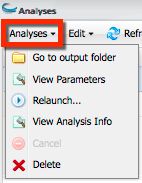
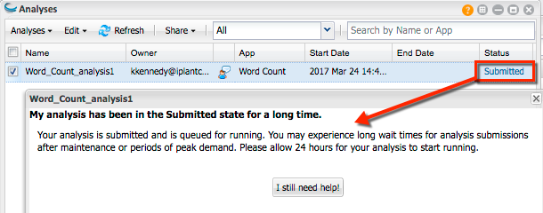
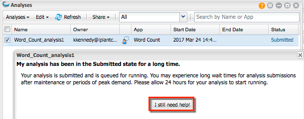

.. include:: cyverse_rst_defined_substitutions.txt
|CyVerse logo|_

|Home_Icon|_
`Learning Center Home <http://learning.cyverse.org/>`_

=========================
Using the Analyses Window
=========================

The Analyses window is where you view the output files, output folders, and status of your analyses. You also can view the parameters you used when you submitted the analysis, relaunch an analysis with the same settings or alter them as desired, cancel an executing analysis, and delete an analysis file or folder. You also can share analysis results with collaborators, rename an analysis, and add or edit comments about the analysis.

|AnalysisWindow|

----------------------------------------------------
Viewing the status of your analysis and getting help
----------------------------------------------------

After launching your analysis, its status is displayed in the Analyses window in the Status column. If you think something may be wrong with the job—maybe it hasn't progressed past Submitted or your analysis completed but you didn't receive any output files—click the status link to get help. Depending on the current status, you will view possible issues and the opportunity to get help, all within the DE window.

For example, if your status has been in the Submitted state for a long time, click **Submitted** to view possible reasons why it has not progressed:

|AnalysisStatus|

Read the help info shown, and after waiting the recommended 24 hours, click **I still need help**, enter details in the Comments field, click the checkbox to agree, and click **Submit**.

If the status of your analysis is failed, click **Failed** to view possible reasons why it is failed:

|ts-1|

Read the help info shown and if that doesn't help you troubleshoot, click **I still need help**, enter details in the Comments field, click the checkbox to agree, and click **Submit**.

|ts-2|

--------------
Analyses menus
--------------

Using the Analyses menu
-----------------------

The Analyses menu contains commands to let you go to the output folder for your analysis, view the parameters used in the analysis, relaunch an analysis with the same settings, view info about the analysis including the Job ID and job type, cancel a running analysis, and delete the results of an analysis. To learn more about the Analysis menu options, see `Relaunching, Canceling, and Deleting Analyses, Viewing Analysis Outputs and Info <http://hammer.cyverse.org:8090/display/DEmanual/Relaunching%2C+Canceling%2C+and+Deleting+Analyses%2C+Viewing+Analysis+Outputs+and+Info>`_.

|AnalysesMenu|

Edit menu
---------

The Edit menu contains command that allow you to rename an analysis and edit, add, or view comments about an analysis. To learn more about the Analyses Edit menu options, see `Renaming an Analysis and Adding Comments (Edit menu) <http://hammer.cyverse.org:8090/pages/viewpage.action?pageId=11446459>`_.

|Analyses_EditMenu|

Refresh menu
------------

Click |refreshicon| periodically to view updated results. You also may want to refresh your browser window.

Share menu
----------

The Share menu allows you to share and unshare your analysis results with collaborators. To learn more, see `Sharing and Unsharing an Analysis <http://hammer.cyverse.org:8090/display/DEmanual/Sharing+and+Unsharing+an+Analysis>`_.

Filtering the Analyses list
---------------------------

You can view all analyses–yours and those that have been shared with you by other users, only your analyses, or only the analyses that have been shared with you by others. To do so, click the drop-down list and select either **All, Only my analyses, or Analyses shared with me.**

Searching for an analysis
-------------------------

You can filter (search) the list to find an analysis or app that was used in an analysis.

    1. In the Analyses window search field, enter at least 3 characters (case-insensitive) of the analysis or app used in the analysis.
    2. Within the search query, you can use the wildcards * (returns any character sequence) and ? (returns any single character sequence) to widen your search. You cannot start the query with a wildcard.

------------
Window icons
------------

At the top right of each data, apps, or analyses window are icons to help you learn more about the DE, and manage the window's size and display.

.. list-table::
    :header-rows: 0

    * - |helpiconwindow|
      - **Help:** Click to open the FAQs page for the current window. 
    * - |WindowIcon-cascadeTile|
      - **Layout:** Resizes the window layout to half of the available available desktop space and positions it either to the left (**Snap Left**) or right side (**Snap Right**) of the window.
    * - |WindowIcon-minMaxClose|
      - Minimize, Maximize, or close the active window. 

--------------------------------------------------------------------------------
Relaunching, Canceling, and Deleting Analyses, Viewing Analysis Outputs and Info
--------------------------------------------------------------------------------

The Analyses menu contains the list of all submitted, running, completed, and failed analyses. You `submit the analysis <http://hammer.cyverse.org:8090/display/DEmanual/Submitting+an+Analysis>`_ in the Apps window and view the outputs or manage your analyses in the Analyses window.

After an analysis is completed, you can view the outputs of the analysis, the parameters you used to run the analysis, and different `log files <http://hammer.cyverse.org:8090/display/DEmanual/About+Log+Files>`_ that provide useful information about the results. You also can troubleshoot a failed analysis from the Analyses window, and `view troubleshooting pointers <http://hammer.cyverse.org:8090/display/DEmanual/Troubleshooting+an+Analysis>`_.

|AnalysesMenu|

Viewing analysis output files (Go to output folder)
---------------------------------------------------

1. In the Analyses window, find the analysis whose results you want to view with the status of Completed.

.. tip:: You may need to click |refreshicon| or refresh your browser window.

2. Click the checkbox next to the analysis name, click **Analyses**, and then click **Go to output folder**.
   You also can click the name in the Analyses list and view results in the Data window.

Viewing the parameters used for the analysis
--------------------------------------------

After an analysis is completed, you can view the parameters you used to run the analysis. This is useful if you want to confirm or save the settings or files you used for the analysis. You also can view the outputs of the analysis and different log files, which provide useful information about the results.

    1. In the Analyses window, click the checkbox next to the completed analysis, click **Analyses**, and then click **View Parameters**.
    2. To save the parameters, click **Save As**, specify the file name and location, and click **OK**.

Viewing the status of an analysis and getting help
--------------------------------------------------

New for the 2.11 release is the ability to view more information about the status of an analysis that is taking a long time to complete or didn't return the expected output files, and then request help within the DE.

1. In the Analyses window, click the status of the analysis in the right column:

|AnalysisHelp|

2. View the Help text that is displayed (the current status defines what is displayed).
3. If you still need help, click I still need help:

|AnalysisHelpSubmitted|

4. Enter additional comments about the analysis, click the checkbox to agree to share your output files and details with Support staff, and click **Submit**.
   You will receive a response within 2 work days.

Relaunching an analysis with the same or different settings
-----------------------------------------------------------

You can relaunch an analysis with the same settings used in a previous analysis. This is useful if you want to change some but not all of the settings used for the previous analysis or just want to relaunch the same analysis with the same settings.

    1. In the Analysis window, click the name of the app in the App column for the analysis to rerun. A window opens with the same settings as used in the previous analysis.
    2. Change settings or inputs as needed.
    3. Click **Launch Analyses**,

    .. tip:: You also can relaunch by clicking the checkbox for the analysis you want to relaunch, clicking the **Analyses** menu and then clicking **Relaunch**.

Viewing the Job ID and Type for an analysis
-------------------------------------------

A useful tool for troubleshooting a failed Agave Analysis is sharing the job ID and job type with Support.

    1. In the Analysis window, click the checkbox for the analysis to relaunch.
    2. Click **Analyses** and then click **View Analysis Info**.
    3. To copy the Job ID, double-click on the ID and copy the string.

Canceling an executing analysis
-------------------------------

You can cancel an analysis that is currently in a status of Submitted, Running, or Idle. This can be useful when an analysis has been running much longer than expected, or you simply want to cancel the analysis, make a change, and resubmit without having to wait for the analysis to complete.

    1. In the Analyses window, click the checkbox for the analysis that is in Submitted, Running, or Idle status.
    2. Click **Analyses** and then click **Cancel**.
        A popup is displayed in the bottom right corner that the analysis has been canceled, and your Notifications and Analyses lists show that the analysis failed.

If the analysis cannot be canceled, please `email CyVerse Support <support@cyverse.org>`_ with the analysis name so they can terminate the analysis.

Deleting analysis results
-------------------------

As an analysis proceeds, its status is displayed in the Analyses window and Notifications list. Once it has completed its execution, you can delete it.

    1. In the Analyses window, select the checkbox for the completed analysis to delete.
    2. Click Analyses and then click Delete.
    3. Click OK to the warning prompt.

You also can delete analysis results in the Data window by `moving the results files to the trash <http://hammer.cyverse.org:8090/pages/viewpage.action?pageId=11446737>`_.

---------------------------------------------------
Renaming an Analysis and Adding Comments (Edit menu)
---------------------------------------------------

Within the Edit menu in the Analyses window, you can rename an analysis and view, add, and edit comments about an analysis.

|Analyses_EditMenu|

Renaming an analysis
--------------------

You can rename an analysis that is in a status of Completed, Canceled, or Failed.

    1. In the Analyses window, click the analysis name you want to rename.
    2. Click **Edit** and then click **Rename**.
    3. Edit the name and click **OK**.

Updating comments about an analysis
-----------------------------------

You can add, edit, and view comments at any time.

    1. In the Analyses window, `find the analysis <https://pods.iplantcollaborative.org/wiki/display/DEmanual/Using+the+Analyses+Window#AnalysisSearch>`_ whose comments you want to add or update.
    2. Either:
        - Click |AppsCommentIcon| (Comments) next to the name of the analysis whose comments you want to view.

            or
        
        - Click **Edit** and then click **Update Comments**.
    
    3. In the Comments window, add, edit, or view the comments and click **OK**.

---------------------------------
Sharing and Unsharing an Analysis
---------------------------------

All analyses—both DE and Agave—now can be shared in any status within the DE beginning with the 2.11 release. When you do so, the output results files, input files, and parameters you used in the analysis are shared.

.. note:: **About Sharing Permissions**:
        When sharing an analysis that used an unpublished Agave app, it is important to understand that sharing permissions for Agave apps are different from sharing permissions for DE apps. Unless you are an Agave expert, we recommend that you set permissions for your unpublished Agave app within the DE rather than within Agave in order to avoid possible conflicts.

Opening the Select Collaborators window
---------------------------------------

    1. In the Analyses window, click the checkbox for the analysis to share.
    2. Click the **Share** menu and then click **Share with collaborators**.
    3. Click Choose **Collaborators**.

Sharing an analysis with a collaborator
---------------------------------------

    1. In the Select Collaborators window, either:
        - Select an existing collaborator with whom you want to share the analysis by clicking a name in your list and then clicking **OK**. For information on creating and managing your collaborators list, see `Adding and Deleting Users from the Collaborators List in Preferences <http://hammer.cyverse.org:8090/display/DEmanual/Adding+and+Deleting+Users+from+the+Collaborators+List+in+Preferences>`_.
          or 
        - Add and share the analysis with a new collaborator by clicking **Manage Collaborators**, entering the first few letters of the user to add, clicking the user, and then clicking **OK**.

Both the owner and the recipient receive notification that the analysis has been shared.

Unsharing an analysis with a collaborator
-----------------------------------------

    1. In the Select Collaborators window for the analysis, click the user's name for the sharing to revoke.
    2. Click |xicon|.
    3. Click **Done**.
    
-------------------------
Searching for an Analysis
-------------------------

You can filter (search) the list to find an analysis or app that was used in an analysis.

    1. In the Analyses window search field, enter at least 3 characters (case-insensitive) of the analysis or app used in the analysis.
    2. Within the search query, you can use the wildcards * (returns any character sequence) and ? (returns any single character sequence) to widen your search. You cannot start the query with a wildcard.

-------------
Analyses FAQs
-------------

These questions are also available within the DE. To view them there, open the Analyses window and then click |helpiconwindow|. You can also view the Data FAQs within the Data window and the Apps FAQs within the Apps window.

- **Why has my job failed or been running forever?**
    `Troubleshooting a Failed Analysis <https://pods.iplantcollaborative.org/wiki/display/DEmanual/Troubleshooting+a+Failed+Analysis>`_ will help you determine what went wrong and collect information for CyVerse staff in case you cannot resolve the problem yourself.

- **How do I get help with a tool (app) or workflow?**
    The steps to get help depend on whether you’re a novice or an expert with the tool—executable or binary—on which the app or workflow is based.

    **Novice**

        1. **Learn more about the tools used:**

            - Search the internet for the publication describing the tool and any related documentation.

            - Make sure you understand what the tool is designed to do, what inputs it can accept and in which format, and how to set any parameters.

        2. **Search the internet for informative sites in your domain**. For example, `SEQanswers <http://seqanswers.com/>`_ is the go-to online forum for the next-generation sequencing community.

        3. **Talk with someone at your institution** who is more experienced with the tool.

        4. **Try to use the app in the Discovery Environment**. Click |infoicon| next to the app name to view the app manual and its sample test input files and expected outputs.

        5. **Search** `Ask CyVerse <http://ask.cyverse.org/>`_ for the answer. If it is not there, post a question.

    **Experienced with the tool or workflow**

    If you are experienced with the tool or workflow and need advice for how to work with very large-scale data or a complex workflow, you may request community support or `Extended Collaborative Support <http://www.cyverse.org/collaborate>`_.

- **Why is my analysis sitting in the Submitted state for so long?**

Analyses that use an app that runs on an HPC system can remain in the Submitted state for hours or even days. They may sit in in the queue in Submitted state waiting to run, along with other possibly long-running jobs that were in the queue first. Therefore, it may take several days for your analysis to get its turn to run. Once your analysis runs, its results will be returned to the Data Store and the DE status will change to Completed. See `Troubleshooting a Failed Analysis <https://pods.iplantcollaborative.org/wiki/display/DEmanual/Troubleshooting+a+Failed+Analysis>`_ for more information on the different statuses and why an analysis might not complete.

- **Is there a limit to how many analyses (jobs) I can run at the same time in the Discovery Environment?**

Only 8 of your analyses will run at the same time. It’s fine to launch more, but they will not run until some of your analyses have completed.

- **I’m trying to run an analysis, but when I enter an input I can’t see my files. Why? I know they are there.**

Because the app requires a folder as input, not a file, the files don’t show since they aren’t the appropriate inputs for the app. The files are indeed there but don’t show. Check the app’s input box; if it says “Select a folder”, then it requires a folder input. Put the file(s) you want to input into a folder and then use that folder as input. Note: You can use Drag and Drop to input the folder by finding it in the Data window, making sure the folder name is shown in the center panel, and then `dragging <https://wiki.cyverse.org/wiki/display/DEmanual/Moving+a+Data+File+or+Folder#MovingaDataFileorFolder-DragDrop>`_ the folder into the app’s input box.

- **How do I rerun a job I previously ran in the DE, but change some parameters or use a different input?**

You can easily relaunch the same analysis with different settings:

    1. In the Analyses window, click the app name in the App column for the analysis to rerun. This opens up an app window for that app, which is already configured with the inputs and settings you used for the previous analysis run.
    2. Change settings or inputs as needed.
    3. Click **Launch Analysis** to launch the new analysis.

`Learn more here. <https://wiki.cyverse.org/wiki/pages/viewpage.action?pageId=11446455#Analyses%20Menu:%20View%20Outputs,%20Parameters,%20and%20Info;%20Relaunch,%20Cancel,%20and%20Delete-Relaunch>`_

- **How do I run the same analysis on a number of files most efficiently?**

You can create a file that contains a list of up to 16 files to use as input for high-throughput and batch file execution. Such a file is called an HT Analysis Path List file. Learn more here, and if you still have questions, read here.

- **I have a series of files that need to be analyzed by the same app, but the output files all have the same name. How do I distinguish them so I can use them in a workflow?**

You can avoid confusion by:

    1. Find the output folder in your Data list,
    2. `Rename <https://wiki.cyverse.org/wiki/display/DEmanual/Renaming+a+Data+File+or+Folder>`_ each output file with a unique name.
    3. Use the files together in a step of the analysis workflow.

----

**Fix or improve this documentation:**

- On Github: |Github Repo Link|
- Send feedback: `Tutorials@CyVerse.org <Tutorials@CyVerse.org>`_
- Live chat/help: Click on the |intercom| on the bottom-right of the page for questions on documentation

----

|Home_Icon|_
`Learning Center Home <http://learning.cyverse.org/>`_

.. Comment: Place Images Below This Line
   use :width: to give a desired width for your image
   use :height: to give a desired height for your image
   replace the image name/location and URL if hyperlinked

 .. |Clickable hyperlinked image| image:: ./img/IMAGENAME.png
    :width: 500
    :height: 100
 .. _CyVerse logo: http://learning.cyverse.org/

 .. |Static image| image:: ./img/IMAGENAME.png
    :width: 25
    :height: 25

.. |AnalysisWindow| image:: img/de/AnalysesWindowStatusLink.jpg

.. |AnalysisStatus| image:: img/de/AnalysisStatus-Submitted1.jpg

.. |ts-1| image:: img/de/ts-1.png

.. |ts-2| image:: img/de/ts-2.png

.. |Analyses_EditMenu| image:: img/de/Analyses_EditMenu.png

.. |refreshicon| image:: img/de/RefreshIcon-Analyses.png

.. |helpiconwindow| image:: img/de/HelpIconWindows.png

.. |WindowIcon-cascadeTile| image:: img/de/WindowIcon-CascadeTile.png

.. |WindowIcon-minMaxClose| image:: img/de/WindowIcon-MinMaxClose.png

.. |AppsCommentIcon| image:: img/de/AppCommentsIcon.png

.. |xicon| image:: img/de/X-icon.jpg

.. Comment: Place URLS Below This Line

   # Use this example to ensure that links open in new tabs, avoiding
   # forcing users to leave the document, and making it easy to update links
   # In a single place in this document

   .. |Substitution| raw:: html # Place this anywhere in the text you want a hyperlink

      <a href="REPLACE_THIS_WITH_URL" target="blank">Replace_with_text</a>

.. |Github Repo Link|  raw:: html

   <a href="FIX_FIX_FIX_FIX_FIX_FIX_FIX_FIX_FIX_FIX_FIX_FIX_FIX_FIX_FIX" target="blank">Github Repo Link</a>
