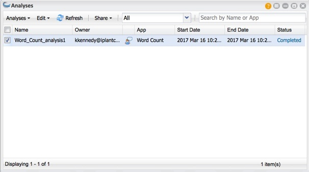
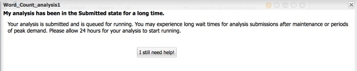
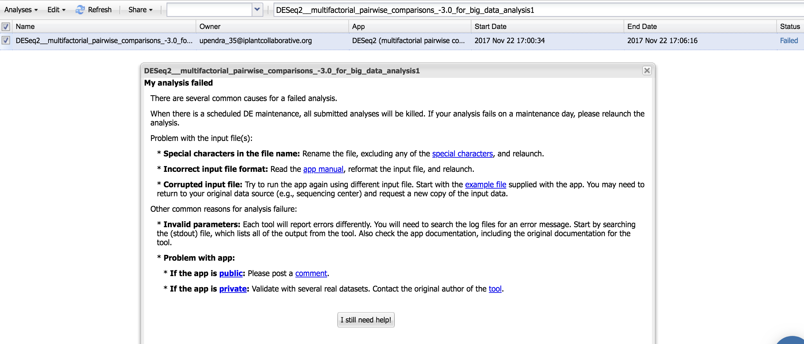
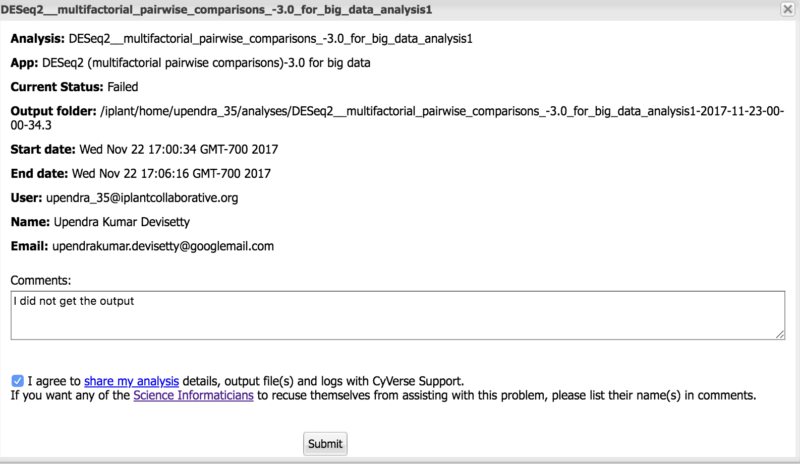
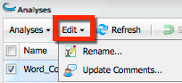

.. include:: cyverse_rst_defined_substitutions.txt
|CyVerse logo|_

|Home_Icon|_
`Learning Center Home <http://learning.cyverse.org/>`_

=========================
Using the Analyses Window
=========================

The Analyses window is where you view the output files, output folders, and status of your analyses. You also can view the parameters you used when you submitted the analysis, relaunch an analysis with the same settings or alter them as desired, cancel an executing analysis, and delete an analysis file or folder. You also can share analysis results with collaborators, rename an analysis, and add or edit comments about the analysis.

|AnalysisWindow|

----------------------------------------------------
Viewing the status of your analysis and getting help
----------------------------------------------------

After launching your analysis, its status is displayed in the Analyses window in the Status column. If you think something may be wrong with the job—maybe it hasn't progressed past Submitted or your analysis completed but you didn't receive any output files—click the status link to get help. Depending on the current status, you will view possible issues and the opportunity to get help, all within the DE window.

For example, if your status has been in the Submitted state for a long time, click **Submitted** to view possible reasons why it has not progressed:

|AnalysisStatus|

Read the help info shown, and after waiting the recommended 24 hours, click **I still need help**, enter details in the Comments field, click the checkbox to agree, and click **Submit**.

If the status of your analysis is failed, click **Failed** to view possible reasons why it is failed:

|ts-1|

Read the help info shown and if that doesn't help you troubleshoot, click **I still need help**, enter details in the Comments field, click the checkbox to agree, and click **Submit**.

|ts-2|

--------------
Analyses menus
--------------

Using the Analyses menu
-----------------------

The Analyses menu contains commands to let you go to the output folder for your analysis, view the parameters used in the analysis, relaunch an analysis with the same settings, view info about the analysis including the Job ID and job type, cancel a running analysis, and delete the results of an analysis. To learn more about the Analysis menu options, see `Relaunching, Canceling, and Deleting Analyses, Viewing Analysis Outputs and Info <http://hammer.cyverse.org:8090/display/DEmanual/Relaunching%2C+Canceling%2C+and+Deleting+Analyses%2C+Viewing+Analysis+Outputs+and+Info>`_.

|AnalysesMenu|

Edit menu
---------

The Edit menu contains command that allow you to rename an analysis and edit, add, or view comments about an analysis. To learn more about the Analyses Edit menu options, see `Renaming an Analysis and Adding Comments (Edit menu) <http://hammer.cyverse.org:8090/pages/viewpage.action?pageId=11446459>`_.

|Analyses_EditMenu|

Refresh menu
------------

Click |refreshicon| periodically to view updated results. You also may want to refresh your browser window.

Share menu
----------

The Share menu allows you to share and unshare your analysis results with collaborators. To learn more, see `Sharing and Unsharing an Analysis <http://hammer.cyverse.org:8090/display/DEmanual/Sharing+and+Unsharing+an+Analysis>`_.

Filtering the Analyses list
---------------------------

You can view all analyses–yours and those that have been shared with you by other users, only your analyses, or only the analyses that have been shared with you by others. To do so, click the drop-down list and select either **All, Only my analyses, or Analyses shared with me.**

Searching for an analysis
-------------------------

You can filter (search) the list to find an analysis or app that was used in an analysis.

    1. In the Analyses window search field, enter at least 3 characters (case-insensitive) of the analysis or app used in the analysis.
    2. Within the search query, you can use the wildcards * (returns any character sequence) and ? (returns any single character sequence) to widen your search. You cannot start the query with a wildcard.

Window icons
------------

At the top right of each data, apps, or analyses window are icons to help you learn more about the DE, and manage the window's size and display.

.. list-table::
    :header-rows: 0

    * - |helpiconwindow|
      - **Help:** Click to open the FAQs page for the current window. 
    * - |WindowIcon-cascadeTile|
      - **Layout:** Resizes the window layout to half of the available available desktop space and positions it either to the left (**Snap Left**) or right side (**Snap Right**) of the window.
    * - |WindowIcon-minMaxClose|
      - Minimize, Maximize, or close the active window. 

----

**Fix or improve this documentation:**

- On Github: |Github Repo Link|
- Send feedback: `Tutorials@CyVerse.org <Tutorials@CyVerse.org>`_
- Live chat/help: Click on the |intercom| on the bottom-right of the page for questions on documentation

----

|Home_Icon|_
`Learning Center Home <http://learning.cyverse.org/>`_

.. Comment: Place Images Below This Line
   use :width: to give a desired width for your image
   use :height: to give a desired height for your image
   replace the image name/location and URL if hyperlinked

 .. |Clickable hyperlinked image| image:: ./img/IMAGENAME.png
    :width: 500
    :height: 100
 .. _CyVerse logo: http://learning.cyverse.org/

 .. |Static image| image:: ./img/IMAGENAME.png
    :width: 25
    :height: 25

.. |AnalysesMenu| image::img/de/Analyses-AnalysesMenu.png

.. Comment: Place URLS Below This Line

   # Use this example to ensure that links open in new tabs, avoiding
   # forcing users to leave the document, and making it easy to update links
   # In a single place in this document

   .. |Substitution| raw:: html # Place this anywhere in the text you want a hyperlink

      <a href="REPLACE_THIS_WITH_URL" target="blank">Replace_with_text</a>

.. |Github Repo Link|  raw:: html

   <a href="FIX_FIX_FIX_FIX_FIX_FIX_FIX_FIX_FIX_FIX_FIX_FIX_FIX_FIX_FIX" target="blank">Github Repo Link</a>
