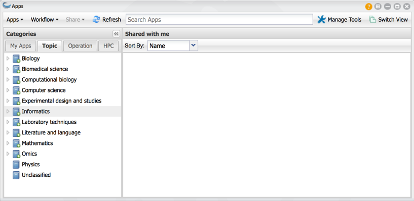
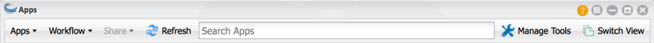
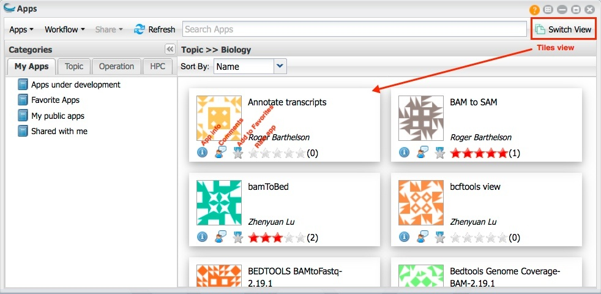
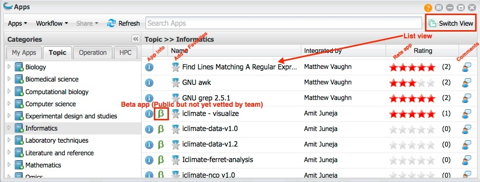
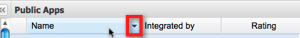

.. include:: cyverse_rst_defined_substitutions.txt
|CyVerse logo|_

|Home_Icon|_
`Learning Center Home <http://learning.cyverse.org/>`_

================================================
Using the Apps Window and Submitting an Analysis
================================================

An app is the mechanism you use to submit an analysis. Within the Apps window, you open the app to use for your analysis, and then select the file or files to use, define the settings as needed, and launch the analysis. 
As the analysis proceeds through the job, you receive updates about its progress. 
Once the analysis is completed, you retrieve and analyze the results. You can view the Apps list by either tiles (the new default) or by list (the previous view).

Quesions about apps?
--------------------

Click |HelpIconWindows| (Help) at the top right of the Apps window in either view.

Refreshing the apps window
--------------------------

Click |Refresh| to update the Apps window.

--------------------------------
Searching for an app or workflow
--------------------------------

At the top of the window, you can search on part of an app or workflow name to find the app or workflow, topic, operation, HPC app, or tool to use. To learn more, see Searching for an App, Workflow, or Tool.

.. tip:: Wondering why an app you used to use isn't there anymore?

   If you are looking for an app that is no longer available that you need to use, first search for a similar app (either by name or by tool). If you cannot find a suitable replacement, contact CyVerse Support at support@cyverse.org.

   Also be aware that you must log in to the Agave server in order to view and use the list of HPC apps. If you have not yet authenticated (you'll only have to do it once or after a major upgrade but you'll be notified), click the HPC tab in the Apps list, or log out of the DE and back in, then log in when prompted to authenticate to the HPC server. For more information, see Using HPC Apps in the DE.

You also can click |HelpIcon| to read FAQs, ask and view questions in Ask CyVerse, and contact Support or submit feedback.

|AppsManageTools|

--------------
Managing Tools 
--------------

The Manage Tools menu is the hub for managing the Discovery Environment **tools** Docker images from which apps are created. Within this menu, you can manage (add, request installation, edit, delete, and use the tool in an app) and share the tool with specific collaborators, with the public, or keep it personal for just your use. For information on the Manage Tools menu, see **Managing Tools in the DE**.

--------------------------------
Customizing the Apps window view
--------------------------------

Switching the Apps list display
-------------------------------

The apps that are displayed in the right panel can be viewed either in tiles view (the default) or list view (the previous display). Both views give you immediate access to the app and tool information used for the app, as well as the ability to quickly enter comments and rate the app. To switch to the other view, click **Switch View** at the top.

|AppsSwitchView_Tiles| |AppsSwitchView_List|

Changing the columns that are displayed
---------------------------------------

You can sort on any column in the Apps list, and hide or show columns to customize the look of your list.

   1. Hover over any column header in the list until a down arrow appears on the right side of the column:

   |ColumnsCustomize|

   2. Click the down arrow:

      - To sort on the column, click either Sort Ascending or Sort Descending.
      - To hide or show a column, point to Columns, and then select or clear the checkbox for the column.

-----------------------
Opening the Apps window
-----------------------

Click **Apps** to open the Apps window.

|AppsManageTools|

-------
Use App
-------

Submitting an Analysis
----------------------

If you are a new user to DE apps, you may want to review Using the Apps Window and Submitting an Analysis before you begin.

For information on submitting a high-throughput or batch analysis, see Using HPC Apps in the DE below and `HT analysis path list file for use in high-throughput and batch file execution <https://cyverse-de-manual.readthedocs-hosted.com/en/latest/managing-dataFileschildpages/creating-newFiles.html>`_.

.. note:: The fields that are required for an analysis depend on the app as it was designed by the integrator. Before you can launch the analysis, you must complete all required steps, which are marked with an asterisk. For information on how to use an app, or to contact the integrator, click |AppInfoIcon| next to the app name in the Apps list to open the app information section.

1. In the Apps window, find the app to use.

.. tip:: If this is an app you use regularly, you can make it a favorite app (not available for HPC apps) to find it more quickly the next time you want to use it.

2. Click the app name to open the app.

.. cation:: 
   
   **About HPC Analyses** 

   **A user can run only 5 HPC analyses at a time, and only 1 HPC analysis if it is running on the large-memory queue**. You can launch additional analyses via the DE, but they will not be submitted to the XSEDE system until another analysis finishes. At the moment, although CyVerse does not limit the total amount of compute time per user, we may need to begin doing so as demand for these resources increases. For more information on HPC apps, see Using HPC Apps in the DE.

3. The app opens, displaying the **panels** for the app, as defined by the app's integrator. Required fields are displayed with a red asterisk next to the field and on the panel header. Complete each field in a panel and then click to open the next one. On the first panel:

   a. Change the analysis name (optional). See `Using Special Characters in the DE <https://cyverse-de-manual.readthedocs-hosted.com/en/latest/managing-dataFileschildpages/uploading-importingData.html>`_ for notes about special characters in analysis names.
   
   b. Enter any comments about the analysis, if you want (not available for HPC apps).

   c. Verify the output folder. To change the output folder location for this analysis, click **Browse** and navigate to the existing folder.

   .. caution:: 

      Selecting a folder that is not your default output folder may result in overwritten data. If you regularly use a different output folder, you can `change the default <https://cyverse-de-manual.readthedocs-hosted.com/en/latest/using_DEchildpages/using-preferences-menu.html#changing-preferences>`_.

   d. To have a copy of all input files returned to the same folder as the analysis results, select **Retain Inputs** (not available for Agave apps).
   
   e. To receive an email notification when the status of the analysis changes, set the email `notification preference <https://cyverse-de-manual.readthedocs-hosted.com/en/latest/using_DEchildpages/using-preferences-menu.html#>`_.

4. Click to open the input data panel:

   a. Click **Browse** in the input file field, navigate to the file location, and click **OK**.

   b. Repeat for each input file to select.
      See `HT analysis path list file for use in high-throughput and batch file execution <https://cyverse-de-manual.readthedocs-hosted.com/en/latest/managing-dataFileschildpages/creating-newFiles.html>`_ for steps on high-throughput or batch analysis.

5. Open each remaining panel and, at minimum, complete each required field.

6. Click **Launch Analysis** and then click **OK** to begin the analysis.

.. tip:: If the analysis does not launch, at least one field on one of the panels contains a required field that has not been completed. All required fields must be completed before you can launch the analysis.

Not sure is the analysis completed, or want to cancel the anlysis?

   To quickly check if the analysis has completed, click |Refresh| or refresh your browser window.
   Want to cancel the analysis? See the Canceling an analysis section on Relaunching, Canceling, and Deleting Analyses, Viewing Analysis Outputs and Info.

Using Test Data 
---------------

Each app in the DE has a user manual that should list the test data files and settings to use when running analyses with that app. This helps you test the app to see how it works and review the output files.

**Importing data files from the app's user manual**

   1. In the Apps window, find the app whose data file you want to use.
   2. Click |AppInfoIcon| to open the app information section.
   3. Click the **User Manual** link on the Information tab.
   4. In the **Test Data** section, follow the instructions to copy the URL for the file to import, and then import the file from URL.
   5. Repeat for each data file to import.

.. note:: To contact the app's integrator, copy the integrator's email address listed on the app information tab and send an email.

----

**Fix or improve this documentation:**

- On Github: |Github Repo Link|
- Send feedback: `Tutorials@CyVerse.org <Tutorials@CyVerse.org>`_
- Live chat/help: Click on the |intercom| on the bottom-right of the page for questions on documentation

----

|Home_Icon|_
`Learning Center Home <http://learning.cyverse.org/>`_

.. Comment: Place Images Below This Line
   use :width: to give a desired width for your image
   use :height: to give a desired height for your image
   replace the image name/location and URL if hyperlinked

 .. |Clickable hyperlinked image| image:: ./img/IMAGENAME.png
    :width: 500
    :height: 100
 .. _CyVerse logo: http://learning.cyverse.org/

 .. |Static image| image:: ./img/IMAGENAME.png
    :width: 25
    :height: 25

.. Comment: Place URLS Below This Line

   # Use this example to ensure that links open in new tabs, avoiding
   # forcing users to leave the document, and making it easy to update links
   # In a single place in this document

   .. |Substitution| raw:: html # Place this anywhere in the text you want a hyperlink

      <a href="REPLACE_THIS_WITH_URL" target="blank">Replace_with_text</a>

.. |Github Repo Link|  raw:: html

   <a href="FIX_FIX_FIX_FIX_FIX_FIX_FIX_FIX_FIX_FIX_FIX_FIX_FIX_FIX_FIX" target="blank">Github Repo Link</a>
