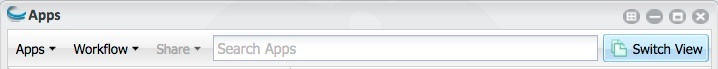
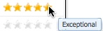
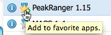
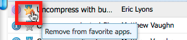

.. include:: cyverse_rst_defined_substitutions.txt
|CyVerse logo|_

|Home_Icon|_
`Learning Center Home <http://learning.cyverse.org/>`_

================================================
Using the Apps Window and Submitting an Analysis
================================================

An app is the mechanism you use to submit an analysis. Within the Apps window, you open the app to use for your analysis, and then select the file or files to use, define the settings as needed, and launch the analysis. 
As the analysis proceeds through the job, you receive updates about its progress. 
Once the analysis is completed, you retrieve and analyze the results. You can view the Apps list by either tiles (the new default) or by list (the previous view).

Opening the Apps window
-----------------------

Click **Apps** to open the Apps window.

|AppsManageTools|

Quesions about apps?
--------------------

Click |HelpIconWindows| (Help) at the top right of the Apps window in either view.

Refreshing the apps window
--------------------------

Click |Refresh| to update the Apps window.

Searching for an app or workflow
--------------------------------

At the top of the window, you can search on part of an app or workflow name to find the app or workflow, topic, operation, HPC app, or tool to use. To learn more, see Searching for an App, Workflow, or Tool.

.. tip:: Wondering why an app you used to use isn't there anymore?

   If you are looking for an app that is no longer available that you need to use, first search for a similar app (either by name or by tool). If you cannot find a suitable replacement, contact CyVerse Support at support@cyverse.org.

   Also be aware that you must log in to the Agave server in order to view and use the list of HPC apps. If you have not yet authenticated (you'll only have to do it once or after a major upgrade but you'll be notified), click the HPC tab in the Apps list, or log out of the DE and back in, then log in when prompted to authenticate to the HPC server. For more information, see Using HPC Apps in the DE.

You also can click |HelpIcon| to read FAQs, ask and view questions in Ask CyVerse, and contact Support or submit feedback.

|AppsManageTools|

Managing Tools 
--------------

The Manage Tools menu is the hub for managing the Discovery Environment **tools** Docker images from which apps are created. Within this menu, you can manage (add, request installation, edit, delete, and use the tool in an app) and share the tool with specific collaborators, with the public, or keep it personal for just your use. For information on the Manage Tools menu, see **Managing Tools in the DE**.

Customizing the Apps window view
--------------------------------

-------------------------------
Switching the Apps list display
-------------------------------

The apps that are displayed in the right panel can be viewed either in tiles view (the default) or list view (the previous display). Both views give you immediate access to the app and tool information used for the app, as well as the ability to quickly enter comments and rate the app. To switch to the other view, click **Switch View** at the top.

|AppsSwitchView_Tiles| |AppsSwitchView_List|

---------------------------------------
Changing the columns that are displayed
---------------------------------------

You can sort on any column in the Apps list, and hide or show columns to customize the look of your list.

   1. Hover over any column header in the list until a down arrow appears on the right side of the column:

   |ColumnsCustomize|

   2. Click the down arrow:

      - To sort on the column, click either Sort Ascending or Sort Descending.
      - To hide or show a column, point to Columns, and then select or clear the checkbox for the column.

About categories
----------------

In the left panel, the Categories are displayed.

   - **My Apps**: Apps and workflows you are in the process of `creating and editing <https://cyverse-de-manual.readthedocs-hosted.com/en/latest/new-appInterface.html>`_ that you have not yet made public, your favorite apps, the apps you have already `made public <https://cyverse-de-manual.readthedocs-hosted.com/en/latest/new-appInterfacechildpages/sharing.html>`_, and the apps that have been shared with you by other users. Click the **My Apps** tab, click the folder to use, and then click the app to use in the right panel. Note that the category name is displayed above the right panel.
   - **Topic**: Public apps categorized by science type (such as biology, biomedical science, etc.). Click the **Topic** tab, navigate through the categories to the correct topic, and then click the app to use in the right panel. The path and category name are displayed above the right panel.
   - **Operation**: Public apps categorized by operation type (such as alignment, analysis, etc.). Click the **Operation** tab, navigate through the categories to the correct operation, and then click the app to use in the right panel. The path and category name are displayed above the right panel.
   - **HPC**: High-performance computing (HPC) apps that may be submitted directly to the Agave API. HPC apps, which are contained in a different repository, require that you sign in to the Agave server the first time you open either the DE, the Apps window, or click the **HPC** tab. Once you have done so, you will rarely have to authenticate again. Click the HPC tab, authenticate if necessary using your CyVerse username and password, and then click the app to use in the right panel. For more information, see Using HPC Apps in the DE and `The Agave API <http://agaveapi.co/>`_.

Based on the `EDAM ontology <http://edamontology.org/page>`_, categories under Topic and Operation help you more quickly find an app or workflow for the type of analysis you need to do. An app can be tagged with more than one category and can appear in more than one tab. Apps that have not yet been categorized are located in the Unclassified categories of the Topic and Operation tabs. All apps are available in search by name, integrator, and tool used for the app.

You can search for an app by name, integrator, tool used for the app, topic, or operation. Once you have authenticated to the Agave apps using your CyVerse username and password (usually required only the first time you log in to the DE and rarely thereafter), the list of HPC apps will also be displayed in search results and within the HPC tab. If the HPC app has been tagged with Topic and Operation terms, it will also show up under those tabs. 

In the right panel, you can view details about the app, such as the integrator's name, and any ratings and comments entered by other users. Click the name of the app to use for your analysis from this section.

About app status
----------------

Depending on the status of the app, it may display an icon to denote its status (if no icon is displayed, the app is a public app). In the tiles view, the icon is displayed at the bottom right of the tile, while in the list view, the icon is displayed to the left of the app name.

   - **Private** apps (either an app you created and have not yet made public, or a private app that has been shared with you by another user) have a blue lock icon: |PrivateAppIcon|.
   - **Beta** apps (Apps that have been made public but have not yet been vetted by our team) have a green Beta icon: |Beta|.
   - **Disabled** apps (apps that can no longer be used, most often because they don't work properly) have a red X icon: |xicon|.
   - **Public** apps that are not in beta or disabled status have no icon.

Viewing categories
------------------

To view the categories used for the app or the list of other apps in the same category:

   1. Click the category tab to use and select the app whose categories you want to view.
   2. Click |AppInfoIcon| to the left of the app name:

|AppInfoWithCat|

   3. Next to Category, click **Operation** or **Topic** to expand the category.
   4. Click through the tree to view other apps in that category.

You also can add the app to your Favorite Apps in your My Apps list, click **User Manual** to view the app's manual, and `share the URL <https://cyverse-de-manual.readthedocs-hosted.com/en/latest/new-appInterfacechildpages/sharing.html>`_ for the app with another user, click **App URL**, and then copy and send the URL to the recipient.

Requesting a new or different category
--------------------------------------

You can request that a public app be added to a different or additional category, or suggest addition of a new category. If the curators determine it is appropriate, they will add the app to that category within one month for existing categories. New categories may take longer if they require updates to the EDAM ontology. 

To request a new or additional category for an app, click |AppCommentsIcon| to the right of the app name and enter the requested category as a comment. Your suggestion will be emailed to the app integrator and CyVerse app curators.

.. note::
   Wondering why an app has a funny symbol or is no longer in the list?

   Apps with |xicon| are disabled and currently not available for use.

   Apps with |beta| are public apps that have not yet been vetted by the CyVerse team.

   Apps with |PrivateAppIcon| are private apps that you either you created or that have been shared with you by another user.

   **If an app is no longer returned in a search query**, it may have been deprecated as part of the app recategorization efforts. You can use a similar app by searching for an app with a similar name or that uses the same tool. If you are the app integrator or need access to the app from a link in a publication, contact CyVerse Support at support@cyverse.org for assistance.

   It's also possible you haven't **authenticated** to the HPC server. You are prompted to log in to the server when you log in to the DE, open the Apps window, or click the HPC tab. Once you have authenticated, you won't see the prompt again unless major changes to the HPC server require re-authentication, which should happen rarely. So if the app you are searching for is in the HPC list, logging in will return the app to you in search results.

You can view, rate, and add comments about an app.

Using Apps
----------

Apps are the mechanism you use in the DE to submit your analysis. **See Using the Apps Window and Submitting an Analysis** for information on submitting an analysis and navigating within the Apps window.

You can view information about the app interface and the tool (executable or binary) used for the app in the Information window.

For an overview of the Apps window menus, see **Using the Apps Window and Submitting an Analysis**.

--------------
Viewing an app
--------------

Once you have identified the app to use, click it to open the app window.

Each app has a basic set of standard interface elements, as shown in this example of FASTX quality filter:

|AppsFastX|

.. list-table::
      :header-rows: 0
     
      * - 1
        - App name, as defined by the app's integrator
      * - 2
        - Window icons.
      * - 3
        - Panels: 
        
            - Contents of each panel are defined by the integrator who created the app. The first panel is where you enter specifics about the analysis, including the analysis name, description, selected output folder, and whether to have input files returned with the analysis output files. 
            - Note the red asterisks * on the second and third panels, indicating that they contain a required field. Each required field also has a red asterisk.
      * - 4
        - Click to open or close a panel.
      * - 5
        - Click to launch the analysis. Note that you must complete all required fields in the analysis before the analysis can be launched.

Main steps to submitting an analysis
------------------------------------

This is a brief overview of the main steps required to submit an analysis.

Before you begin, you may want to view a `video <http://www.youtube.com/watch?v=Ah8sKlIeglI&feature=em-uploademail>`_ about running analyses in the Discovery Environment. Please note that this is for release version 1.6, and may look and function differently from this release.

   1. In the Apps window, click to open the app to use.
   2. Select the input data file or files and specify the settings.
   3. Launch the analysis.
   4. View progress of the analysis in the Notifications list.
   5. When the analysis is completed, review the results in the Analyses window, including:

      - View outputs or results of analyses
      - Manage or delete data
      - Delete analyses outputs
      - Troubleshoot failed analyses

Using HPC Apps in the DE
------------------------

Most CyVerse Discovery Environment (DE) applications that are listed in the High-Performance Computing (HPC) category, as well as CyVerse applications which run through our `Agave API <http://agaveapi.co/>`_, run at `TACC <https://www.tacc.utexas.edu/>`_ (the Texas Advanced Computing Center), part of the `XSEDE <https://www.xsede.org/>`_ (Extreme Science and Engineering Discovery Environment) national supercomputing network. Access to this powerful resource is made available to CyVerse users at no cost to the user through a grant from the National Science Foundation.

In order to fairly distribute this high-demand resource, both XSEDE and TACC follow allocation policies that limit how long any single analysis can be run (usually 24 or 48 hours, depending on the queue), how many analyses a user can have running simultaneously , and the total amount of computational time any one user can access over the course of a year. Analyses (also known as jobs) submitted through the CyVerse DE run on XSEDE using the same queues as every other scientist in the country uses. Thus, if there are many analyses or a few very large analyses in the queue, the wait time for each analysis can be very long, up to several days for certain applications.

--------------------------------------------
Want to apply for your own XSEDE allocation?
--------------------------------------------

See the `XSEDE allocation policy page <https://portal.xsede.org/allocation-policies>`_.

------------------------
Understanding HPC queues
------------------------

Queues on HPC systems are much like queues at the coffee shop: the first analysis submitted is the first one to run. However, to efficiently exploit resources, HPC queues also have features similar to amusement parks that squeeze single riders in with larger groups. On an HPC system, this consists of scheduling jobs that are shorter or that use fewer nodes into smaller blocks that can be placed in between longer jobs. XSEDE supercomputing centers generally have more than one supercomputer, and the supercomputers have multiple queues for different types of analyses (e.g., serial, parallel, large memory). Each center/computer/queue has its own rules and algorithms for ensuring fair and efficient allocation of resources.

**Optimizing the runtime of an HPC analysis**

Because the size of data files frequently used for HPC apps can be quite large, it is strongly suggested that you consider the following when submitting your HPC analyses:

.. caution:: 

   **About launching HPC analyses**

   **A user can run only 5 HPC analyses at a time, and only 1 HPC analysis if it is running on the large-memory queue**. You can launch additional analyses via the DE, but they will not be submitted to the XSEDE system until another analysis finishes. At the moment, although CyVerse does not limit the total amount of compute time per user, we may need to begin doing so as demand for these resources increases.

- Submit your analyses at a time of low demand—generally, Friday and Saturday nights tend to be low-demand times.
- Choose the app with the shortest runtime or fewest nodes when analyzing smaller datasets  

- Consider an HPC app that doesn't run on the TACC large memory queue.

- List of CyVerse apps running on the TACC large memory queue
   
   - AllpathsLG 48777
   - GeneSeqer-large (Stampede) 5.0.0
   - IDBA-UD (1000GB-24:00:00) 1.1.2
   - InterProScan Sequence Search 5.17.56
   - Maker-P v.2.3 for annotation genomes 300Mb-500Mb 2.3
   - Newbler 2.6.0
   - Oases 0.2.08
   - Ray-2.2.0
   - Soapdenovo 2.04
   - Soapdenovo-Trans-1.01
   - SPAdes-high-mem 3.6.0
   - Trinity normalize_k-mer_coverage r11.10.13
   - Trinity r2013-11-10
   - Velvetg-1.2.08
   - Velveth-1.2.08

- If there are multiple apps for the same analysis method, choose the one that is the appropriate size for your dataset. If you have a small dataset, search for the word "small", which is included in the name or description of many apps that use shorter runtimes or run on fewer nodes.
- Read the app's user manual to help you choose the correct app.

- Where's the user manual?
   - To find the app's user manual, click  to the left of the name and then click User Manual.

- **Do not launch the same analysis multiple times**. Resubmitting the same analysis when it does not appear to be running can tie up the queue, making the problem worse. If you launched an HPC analysis on CyVerse whose status has not changed to a status of Submitted within a few hours or to Running within a few days (assuming you haven't exceeded the maximum number of running analyses), contact support@cyverse.org with the job ID.

- How do I find the job ID?
   - In the Analyses window, click the checkbox for the analysis, click the **Analyses** menu and then click **View Analysis Info**.

Users or groups who have very large computational needs are likely to run into bottlenecks using standard CyVerse infrastructure. We recommend that these users `apply for their own XSEDE allocation <https://portal.xsede.org/allocation-policies>`_, which will allow them to run CyVerse tools and applications on XSEDE with fewer restrictions. Users or groups with very large computational needs should first apply for a startup allocation and use it to benchmark their jobs, thereby collecting data on efficiency of resource use which must be part of a full XSEDE allocation request.

Want to learn more about XSEDE? Visit the `XSEDE Getting Started <https://portal.xsede.org/documentation-overview>`_ documentation or consider signing up for `XSEDE online training <https://www.xsede.org/web/xup/online-training>`_.

Deleting an App or Worlflow
---------------------------

---------------------------------------------
Deleting an app or workflow under development
---------------------------------------------

You can delete an app or workflow that is in your Apps under development Workspace folder. Only CyVerse Support can delete a public app or workflow in the Topic or Operation tabs.

   1. In your **Apps under development** folder, select the app or workflow to delete.
   2. Click either the **Apps** menu or the **Workflow** menu.
   3. Click **Delete**.
      Delete not available?
         - To delete an app you submitted for public use,`contact CyVerse Support <support@cyverse.org>`_.
   4. Click **Yes** to the warning prompt.

----------------------
Submitting an Analysis
----------------------

If you are a new user to DE apps, you may want to review Using the Apps Window and Submitting an Analysis before you begin.

For information on submitting a high-throughput or batch analysis, see Using HPC Apps in the DE below and `HT analysis path list file for use in high-throughput and batch file execution <https://cyverse-de-manual.readthedocs-hosted.com/en/latest/managing-dataFileschildpages/creating-newFiles.html>`_.

.. note:: The fields that are required for an analysis depend on the app as it was designed by the integrator. Before you can launch the analysis, you must complete all required steps, which are marked with an asterisk. For information on how to use an app, or to contact the integrator, click |AppInfoIcon| next to the app name in the Apps list to open the app information section.

1. In the Apps window, find the app to use.

.. tip:: If this is an app you use regularly, you can make it a favorite app (not available for HPC apps) to find it more quickly the next time you want to use it.

2. Click the app name to open the app.

.. caution:: **About HPC Analyses** 

   **A user can run only 5 HPC analyses at a time, and only 1 HPC analysis if it is running on the large-memory queue**. You can launch additional analyses via the DE, but they will not be submitted to the XSEDE system until another analysis finishes. At the moment, although CyVerse does not limit the total amount of compute time per user, we may need to begin doing so as demand for these resources increases. For more information on HPC apps, see Using HPC Apps in the DE.

3. The app opens, displaying the **panels** for the app, as defined by the app's integrator. Required fields are displayed with a red asterisk next to the field and on the panel header. Complete each field in a panel and then click to open the next one. On the first panel:

   a. Change the analysis name (optional). See `Using Special Characters in the DE <https://cyverse-de-manual.readthedocs-hosted.com/en/latest/managing-dataFileschildpages/uploading-importingData.html>`_ for notes about special characters in analysis names.
   
   b. Enter any comments about the analysis, if you want (not available for HPC apps).

   c. Verify the output folder. To change the output folder location for this analysis, click **Browse** and navigate to the existing folder.

   .. caution:: 

      Selecting a folder that is not your default output folder may result in overwritten data. If you regularly use a different output folder, you can `change the default <https://cyverse-de-manual.readthedocs-hosted.com/en/latest/using_DEchildpages/using-preferences-menu.html#changing-preferences>`_.

   d. To have a copy of all input files returned to the same folder as the analysis results, select **Retain Inputs** (not available for Agave apps).
   
   e. To receive an email notification when the status of the analysis changes, set the email `notification preference <https://cyverse-de-manual.readthedocs-hosted.com/en/latest/using_DEchildpages/using-preferences-menu.html#>`_.

4. Click to open the input data panel:

   a. Click **Browse** in the input file field, navigate to the file location, and click **OK**.

   b. Repeat for each input file to select.
      See `HT analysis path list file for use in high-throughput and batch file execution <https://cyverse-de-manual.readthedocs-hosted.com/en/latest/managing-dataFileschildpages/creating-newFiles.html>`_ for steps on high-throughput or batch analysis.

5. Open each remaining panel and, at minimum, complete each required field.

6. Click **Launch Analysis** and then click **OK** to begin the analysis.

.. tip:: If the analysis does not launch, at least one field on one of the panels contains a required field that has not been completed. All required fields must be completed before you can launch the analysis.

Not sure is the analysis completed, or want to cancel the anlysis?

   To quickly check if the analysis has completed, click |Refresh| or refresh your browser window.
   Want to cancel the analysis? See the Canceling an analysis section on Relaunching, Canceling, and Deleting Analyses, Viewing Analysis Outputs and Info.

---------------
Using Test Data 
---------------

Each app in the DE has a user manual that should list the test data files and settings to use when running analyses with that app. This helps you test the app to see how it works and review the output files.

**Importing data files from the app's user manual**

   1. In the Apps window, find the app whose data file you want to use.
   2. Click |AppInfoIcon| to open the app information section.
   3. Click the **User Manual** link on the Information tab.
   4. In the **Test Data** section, follow the instructions to copy the URL for the file to import, and then import the file from URL.
   5. Repeat for each data file to import.

.. note:: To contact the app's integrator, copy the integrator's email address listed on the app information tab and send an email.

Searching for an App, Workflow, or Tool
---------------------------------------

The Apps list is categorized by your list of apps, and published apps by topic, operation, or HPC, as described in Using Apps.

You can search for a specific app or workflow by name, integrator's name, description, description, or tool in the search field. You also can browse through the categories in each tab, and view information about the tool (executable or binary used for the app) by clicking |AppInfoIcon| next to the app name.

If a tool or tool version is not yet available in the DE, you can `request installation of a new tool <https://cyverse-de-manual.readthedocs-hosted.com/en/latest/new-appInterfacechildpages/ManagingToolsinDE.html>`_.

When you find an app you like or use frequently, you can add it to your list of Favorite Apps.

**What's an app? tool? analysis?**

- **App**: Interface of a tool that has been configured and made available for use in the DE. The same tool can be used in more than one app, and may also be created by different integrators with different intents and interfaces.
- **Tool**: Software program (executable binary or executable) that is installed on a server and integrated into the back end of the DE for use in DE apps.
- **Analysis**: Detailed examination of data performed in the DE by selecting one or more apps to perform a desired task for the purpose of discussion or interpretation.

1. In the Apps window, enter a search term in the Search Apps field – app or workflow name, integrator's name, tool name, or part of the app description. As you type, the list of matching apps updates dynamically. If you are searching for an HPC app and have not yet done so, click the prompt to log in to the Agave server.

|AppsMenu|

2. In the results list, click the app or workflow name to select the app. To learn more about the item, click the |AppInfoIcon| icon.

.. note::
   Wondering why an app has a funny symbol or is no longer in the list?

   Apps with |xicon| are disabled and currently not available for use.

   Apps with |beta| are public apps that have not yet been vetted by the CyVerse team.

   Apps with |PrivateAppIcon| are private apps that you either you created or that have been shared with you by another user.

   **If an app is no longer returned in a search query**, it may have been deprecated as part of the app recategorization efforts. You can use a similar app by searching for an app with a similar name or that uses the same tool. If you are the app integrator or need access to the app from a link in a publication, contact CyVerse Support at support@cyverse.org for assistance.

   It's also possible you haven't **authenticated** to the HPC server. You are prompted to log in to the server when you log in to the DE, open the Apps window, or click the HPC tab. Once you have authenticated, you won't see the prompt again unless major changes to the HPC server require re-authentication, which should happen rarely. So if the app you are searching for is in the HPC list, logging in will return the app to you in search results.

----------------------
About deprecated apps
----------------------

If an app name is not returned in a search, the app may have been deprecated. You may want to search for a similar app or contact the integrator to see if there is a suitable alternative or a possibility of unarchiving the app. If you are the app integrator and want to unarchive an app, `contact Support <support@iplantcollaborative.org>`_ for assistance.

If you haven't yet authenticated to the HPC server, HPC apps will not be returned in search results. To do so, click the HPC tab to receive the prompt and then authenticate, or close and reopen the DE to receive the prompt and log in to the Agave server.

Using App Ratings and App Comments
----------------------------------

Public DE apps can be rated and commented on by other CyVerse users. This is useful for providing feedback such as questions about how to use the app, suggestions for improvements, errors in the app or app documentation, useful tips, or letting the integrator and other users know how you use the app.

The Apps list has a Rating column containing 5 stars, ranging from 1 (Not Useful) to 5 (Exceptional). Red stars are the average user rating given by other users, yellow stars are the rating you gave the app, and no stars mean the app has not yet been rated by you or others. The number of ratings that have been received by users toward the rating is also displayed.

-------------
Rating an App 
-------------

.. note:: This feature is not available for Agave apps.

1. In the Apps window, find the app to rate.

.. note::
   Wondering why an app has a funny symbol or is no longer in the list?

   Apps with |xicon| are disabled and currently not available for use.

   Apps with |beta| are public apps that have not yet been vetted by the CyVerse team.

   Apps with |PrivateAppIcon| are private apps that you either you created or that have been shared with you by another user.

   **If an app is no longer returned in a search query**, it may have been deprecated as part of the app recategorization efforts. You can use a similar app by searching for an app with a similar name or that uses the same tool. If you are the app integrator or need access to the app from a link in a publication, contact CyVerse Support at support@cyverse.org for assistance.

   It's also possible you haven't **authenticated** to the HPC server. You are prompted to log in to the server when you log in to the DE, open the Apps window, or click the HPC tab. Once you have authenticated, you won't see the prompt again unless major changes to the HPC server require re-authentication, which should happen rarely. So if the app you are searching for is in the HPC list, logging in will return the app to you in search results.

Red stars are the average rating given by other users, if any.
Yellow stars, if displayed, indicate the rating you gave the app.
1=Not useful, 2=Poor, 3=Works, 4=Very useful, 5=Exceptional
The number to the right of the stars indicates the number of users who have rated the app.

2. To rate an app, click the star that denotes your rating for the app:

|AppRatings|

The stars are now yellow to denote your rating and |RatingsDelete| is displayed to the right of your rating.

3. To change your rating, click the star that more accurately reflects your opinion of the app.

4. To remove a rating:

      a. Click **Favorite Apps** on the **My Apps** tab.
      b. Click |RatingsDelete| to the right of the yellow stars to remove your rating for the app.

-------------------------------
Viewing and adding app comments
-------------------------------

.. note:: This feature is not available for Agave apps.

1. To view other users' comments about an app:
      a. Find the app whose comments you want to view.
      b. Click |AppCommentsIcon| on the right side of the app row.
      c. View the comments at the bottom of the page.
2. To add a comment or reply to a comment:
      a. Click |AppCommentsIcon| on the right side of the app row.
      b. Enter your comments in the lower box and click **Add**.
3.To remove a comment, click the comment in the top section and then click **Retract**.

Using Favorite Apps and Workflows
---------------------------------

----------------------------------------------------
Adding an app or workflow to your Favorite Apps list
----------------------------------------------------

.. note:: This feature is not available for Agave apps.

1. In the Apps window, find the app to favorite.

.. note::
   Wondering why an app has a funny symbol or is no longer in the list?

   Apps with |xicon| are disabled and currently not available for use.

   Apps with |beta| are public apps that have not yet been vetted by the CyVerse team.

   Apps with |PrivateAppIcon| are private apps that you either you created or that have been shared with you by another user.

   **If an app is no longer returned in a search query**, it may have been deprecated as part of the app recategorization efforts. You can use a similar app by searching for an app with a similar name or that uses the same tool. If you are the app integrator or need access to the app from a link in a publication, contact CyVerse Support at support@cyverse.org for assistance.

   It's also possible you haven't **authenticated** to the HPC server. You are prompted to log in to the server when you log in to the DE, open the Apps window, or click the HPC tab. Once you have authenticated, you won't see the prompt again unless major changes to the HPC server require re-authentication, which should happen rarely. So if the app you are searching for is in the HPC list, logging in will return the app to you in search results.

2. Click the star to the left of the name:
|FavAdd|
The star now is yellow and the app or workflow is listed in your Favorite Apps list on the My Apps tab.
|FavAppIcon|

--------------------------------------------------------
Removing an app or workflow from your Favorite Apps list
--------------------------------------------------------

1. Click the **My Apps** tab and then click **Favorite Apps**.
In the app to remove from your Favorite Apps list, click the yellow star to the left of the app name:

|Apps_RemoveFromFavs|

The app is removed from your Favorite Apps list and the star icon next to the name in the Apps list is removed.

Viewing App and Tool Information
--------------------------------

Tucked away in the Apps list is pertinent information about each app or workflow, and its tools (executable or binary) and tool versions upon which the app or workflow is based.

The information that is available is provided by the integrator of the app or workflow: the date shared, the name and email of the integrator who created it, the link to the `user manual <https://cyverse-de-manual.readthedocs-hosted.com/en/latest/new-appInterfacechildpages/sharing.html>`_ page created by the integrator, the URL to the app for quickly sharing it with other CyVerse users, and the ratings submitted by other users. Information about the tool (the executable or binary upon which the app is based) used for the app or workflow can be viewed as well.

You can view the list of all tools that are available in the DE, or simply search for a tool in the Apps window search field. If the tool or tool version you want to use for an app is not available, you can request installation of a new tool or new tool version.

Viewing app information
-----------------------

1. In the **Apps** window, find the app or workflow whose information you want to view.

.. note::
   Wondering why an app has a funny symbol or is no longer in the list?

   Apps with |xicon| are disabled and currently not available for use.

   Apps with |beta| are public apps that have not yet been vetted by the CyVerse team.

   Apps with |PrivateAppIcon| are private apps that you either you created or that have been shared with you by another user.

   **If an app is no longer returned in a search query**, it may have been deprecated as part of the app recategorization efforts. You can use a similar app by searching for an app with a similar name or that uses the same tool. If you are the app integrator or need access to the app from a link in a publication, contact CyVerse Support at support@cyverse.org for assistance.

   It's also possible you haven't **authenticated** to the HPC server. You are prompted to log in to the server when you log in to the DE, open the Apps window, or click the HPC tab. Once you have authenticated, you won't see the prompt again unless major changes to the HPC server require re-authentication, which should happen rarely. So if the app you are searching for is in the HPC list, logging in will return the app to you in search results.

2. Click |AppInfoIcon| to the left of the name.

3. Information about the app is available on the **Information** tab:

|AppInfoWithCat|

- **Favorite App star**: Select |FavoriteStar| at the top left to add it to your Favorite Apps list (also available next to the app name in the Apps list), or click to clear.
- **Description**: Brief description of the app, as entered by the app's integrator.
- **Published on**: Date the app was published to the DE.
- **Integrator name**: Name of the person who integrated the app into the DE.
- **Integrator email**: Email of the person who integrated the app into the DE – handy when you have questions, comments, or issues with the app or the app documentation.
- **Help**: Click **User Manual** to view the user manual, which is written by the app's integrator. Most user manuals contain a brief introduction to how to use the app and steps for trying out the app, including **example input files** and parameters to use. Email the integrator if you have questions about using the app or need more information. For information on creating a documentation page for your apps, see Sharing your App or Workflow and Editing the User Manual.
- **Rating**: Average rating given by other users of the app, if any. If you previously rated this app, the stars will be yellow. You can remove your rating here by clicking |RatingsDelete| for the app you rated. For more information on entering app ratings and comments about an app, see Using App Ratings and App Comments.
- **App URL**: You can send the URL to a public app to quickly share the path with another user. To do so, click **App URL**, copy the URL, paste it into your text messaging or email application, and send. The user must be logged in to access the app.
      - To share an unpublished app (one in your private workspace that has not yet been made public), see Sharing your App or Workflow and Editing the User Manual.
- **Category**: To view the Operation or Topic categories in which the app is placed, click either Operation or Topic, click through the hierarchy, and click the lowest level to view other apps in the same category.

------------------------
Viewing tool information
------------------------

You can view tool information in two ways.

- In the **Apps** window:
   1. In the Apps window, find the app with the tool information to view.
   2. Click the **Tool Information** tab to view information about the tool (executable) used for the app or workflow: app name, description, path, version, and attribution. Email the integrator if you have questions about the tool used for the app.

- In the **Manage Tools** window:
   1. In the Apps window, click **Manage Tools** at the top.
   2. Click to select the tool whose information you want to view.
   3. Click |RatingsDelete|.
   4. View the tool's attribution and description on the Tool Information tab.
   5. Click Apps using this tool tab to view the list of apps that use the tool.

For more information on managing tools, see Managing Tools in the DE.

----

**Fix or improve this documentation:**

- On Github: |Github Repo Link|
- Send feedback: `Tutorials@CyVerse.org <Tutorials@CyVerse.org>`_
- Live chat/help: Click on the |intercom| on the bottom-right of the page for questions on documentation

----

|Home_Icon|_
`Learning Center Home <http://learning.cyverse.org/>`_

.. Comment: Place Images Below This Line
   use :width: to give a desired width for your image
   use :height: to give a desired height for your image
   replace the image name/location and URL if hyperlinked

 .. |Clickable hyperlinked image| image:: ./img/IMAGENAME.png
    :width: 500
    :height: 100
 .. _CyVerse logo: http://learning.cyverse.org/

 .. |Static image| image:: ./img/IMAGENAME.png
    :width: 25
    :height: 25

.. |HelpIconWindows| image:: img/de/HelpIconWindows.jpg

.. |HelpIcon| image:: img/de/HelpIcon.jpg

.. |AppsManageTools| image:: img/de/AppsManageTools_Menu.png

.. Comment: Place URLS Below This Line

   # Use this example to ensure that links open in new tabs, avoiding
   # forcing users to leave the document, and making it easy to update links
   # In a single place in this document

   .. |Substitution| raw:: html # Place this anywhere in the text you want a hyperlink

      <a href="REPLACE_THIS_WITH_URL" target="blank">Replace_with_text</a>

.. |Github Repo Link|  raw:: html

   <a href="FIX_FIX_FIX_FIX_FIX_FIX_FIX_FIX_FIX_FIX_FIX_FIX_FIX_FIX_FIX" target="blank">Github Repo Link</a>
